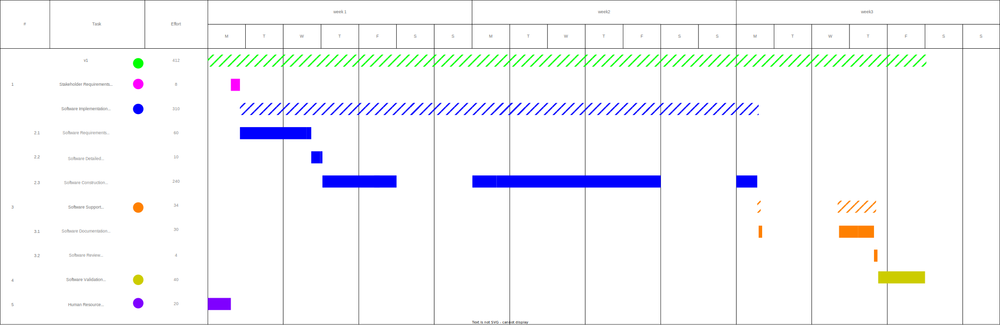

# Project Estimation - CURRENT

Date: 2024-05-01

Version: 1

## Estimation approach

Consider the EZElectronics project in CURRENT version (as given by the teachers), assume that you are going to develop the project INDEPENDENT of the deadlines of the course, and from scratch

## Estimate by size

|                                                                                                        |      Estimate      |                                                                                                             Comments                                                                                                             |
| :----------------------------------------------------------------------------------------------------: | :----------------: | :------------------------------------------------------------------------------------------------------------------------------------------------------------------------------------------------------------------------------: |
|                            NC = Estimated number of classes to be developed                            |         4          |                                                                              We have 4 classes : Authentication, User, Product and Cart Management                                                                               |
|                              A = Estimated average size per class, in LOC                              |       600LOC       | We estimate the Authentication component will require about 300 lines of code (LOC), while Cart Management will need significantly more. Given the complexities involved, 600 LOC is a suitable average estimate for each class. |
|                           S = Estimated size of project, in LOC (= NC \* A)                            |      2400LOC       |                                                                        The size of project is a number of classes times Estimated average size per class.                                                                        |
|          E = Estimated effort, in person hours (here use productivity 10 LOC per person hour)          |  240 person hours  |                                      The total estimated LOC for the project is 2400. Dividing this by 10 LOC per person-hour results in a total estimated labor time of 240 person-hours.                                       |
|                  C = Estimated cost, in euro (here use 1 person hour cost = 30 euro)                   |       €7200        |                                                     The cost per person-hour is €30. When multiplied by the estimated 240 person-hours, the personnel cost amounts to €7200.                                                     |
| Estimated calendar time, in calendar weeks (Assume team of 4 people, 8 hours per day, 5 days per week) | 1.5 calendar weeks |                                            We divide the effort by the number of people working on the project, multiplied by the 8 working hours per day and 5 working days per week                                            |

## Estimate by product decomposition

| Component Name       | Estimated effort (person hours) |                                                       comments                                                       |
| :------------------- | :-----------------------------: | :------------------------------------------------------------------------------------------------------------------: |
| Requirement Document |               100               |                                   Estimated based on our work on the requirements                                    |
| GUI Prototype        |               15                |                                                                                                                      |
| Design Document      |                5                |                                                                                                                      |
| Code                 |               160               | We allocated 240 hours for implementation and testing, with approximately 60% of this time dedicated to just coding. |
| Unit tests           |               40                |                                          20% of 240 hours for unit testing                                           |
| API tests            |               40                |                                          20% of 240 hours for unit testing                                           |
| Management Documents |               20                |                                                                                                                      |

We estimate in total $\displaystyle\frac{\sum E_i}{N * H * W} \approx 2.4$ calendar weeks to complete the project, where $E_i$ is the estimated effort for each component, $N$ is the number of people working on the project, $H$ is the number of working hours per day, and $W$ is the number of working days per week.

## Estimate by activity decomposition

All of our activities are based on the `IEEE 12207` standard.

| Activity name                                      | Estimated effort (person hours) |                                                     Comments                                                     |
| :------------------------------------------------- | :-----------------------------: | :--------------------------------------------------------------------------------------------------------------: |
| a) **Stakeholder Requirements Definition Process** |                8                |        Define the stakeholder classes that have legitimate interest in the system through its life cycle         |
| b) **Software Implementation Processes**           |            $\sum b$             |                                          Implement the software system                                           |
| b.1) Software Requirements Analysis Process        |               60                |                   Analyze the requirements of the system and define the software requirements                    |
| b.3) Software Detailed Design Process              |               10                |                  Includes both the graphical design of the user interface and the domain model                   |
| b.4) Software Construction Process                 |               240               | Produce software that properly reflects the software design, this activity includes unit and integration testing |
| c) **Software Support Processes**                  |            $\sum c$             |                                            Assist the other processes                                            |
| c.1) Software Documentation Management Process     |               30                |                              Develop and maintain the documentation of the software                              |
| c.3) Software Review Process                       |                4                |                                 Review the software from a technical perspective                                 |
| d) **Software Validation Process**                 |               40                |                                Validate that the requirements have been fulfilled                                |
| f) **Human Resource Management Process**           |               20                |   Manage the team and distribute the work in a way that utilizes best each team member's skills and abilities    |

With a total estimated effort of $\sum{\sum_{i=a}^f i} = 412$ person hours, we can calculate that it will take $\approx 2.6$ calendar weeks to complete the project, given a team of 4 people working 8 hours a day, 5 days a week.

### Gantt Chart

Hatched areas represent calendar time.

## Summary

|      Estimate by       | Estimated effort (person hours) | Estimated duration (person calendar weeks) |                                                     Comments                                                     |
| :--------------------: | :-----------------------------: | :----------------------------------------: | :--------------------------------------------------------------------------------------------------------------: |
|          Size          |               240               |                     6                      |                        This estimation is derived only from the provided and missing code                        |
| Product decomposition  |               380               |                    9.5                     | This estimation takes into account more variables than the size estimation, leading to a more accurate estimate. |
| Activity decomposition |               412               |                    10.3                    |                This estimation is the most accurate, as it considers all aspects of the project.                 |
