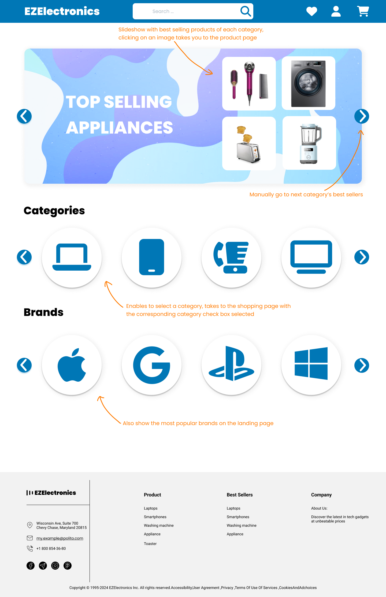
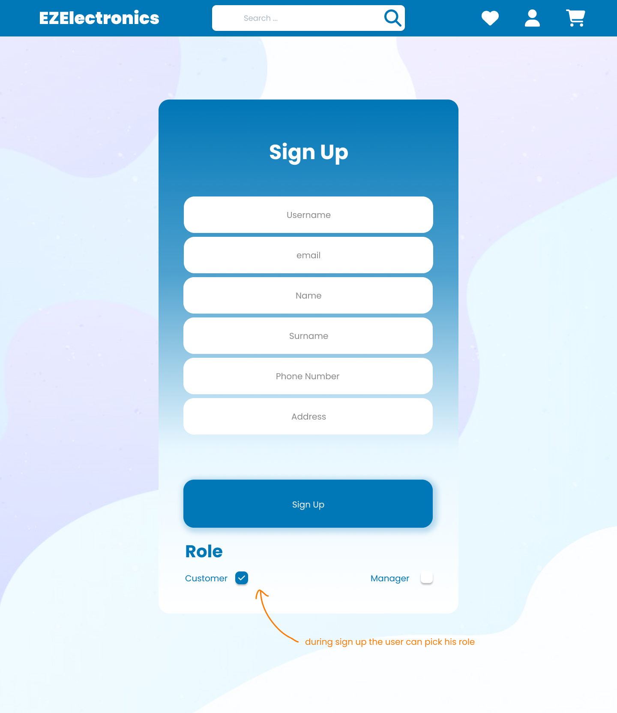

# Graphical User Interface Prototype - FUTURE

Authors: Eduard Occhipinti, Niloofar Bani

Date: 2024-05-04

Version: 2

## Landing Page

We improved it with bestsellers showing up at the top of the page and product categories and models beings electable as buttons instead of just words. At the top we notice the wishlist icon, the user icon (that will take us to login or sign up if the user isn't already logged in) and the cart icon.

## Search Results

Search now enables the user to filter by more variables and in a more user-friendly way. Search results are automatically updated as the user modifies their filter criteria.

## Product Page

Each product now also has a product page that can be accessed by clicking on the product image or name, from there users can see additional information such as reviews and ratings and can choose from which manager to buy the product from from a dropdown menu.

## Login and Sign Up Pages

There are now more fields in the sign-up and the login page also allows the user to recover their password.

## Customer Profile Page

From the customer profile page, the user can see their purchase history and change their information. They can also connect their favorite payment method.

## Cart

The cart now makes it possible to modify the quantity of each product.

## Wishlist

Customers can directly add a product from their wishlist to their cart.

## Manager Pages

Managers can now insert a photo of their product listing and are not required to generate a code manually, we just use `UUID`s instead. Managers can also edit their product listings after they have been published. From the

### Profile Page

### Add Product

### Edit Product

### Manage Inventory

