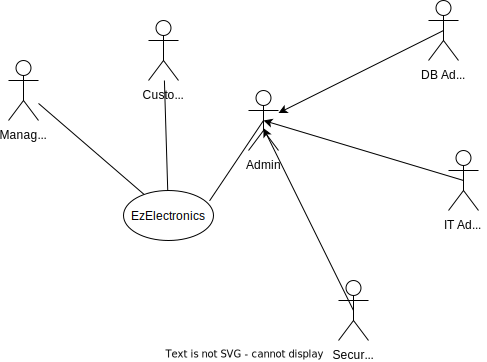
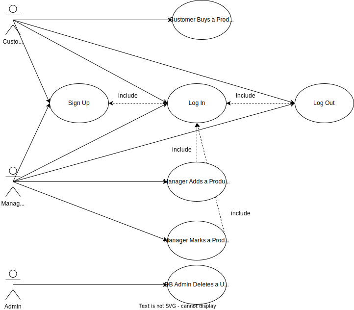
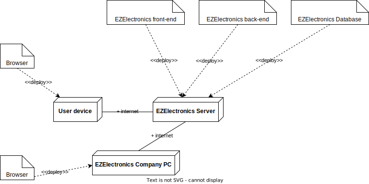

# Requirements Document - current EZElectronics

Date: 2024-05-01

| Version number | Change |
| :------------: | :----: |
|       1        |   /    |

## Contents

-   [Requirements Document - current EZElectronics](#requirements-document---current-ezelectronics)
    -   [Contents](#contents)
    -   [Informal description](#informal-description)
    -   [Stakeholders](#stakeholders)
    -   [Context Diagram and interfaces](#context-diagram-and-interfaces)
        -   [Context Diagram](#context-diagram)
        -   [Interfaces](#interfaces)
    -   [Stories and personas](#stories-and-personas)
    -   [Functional and non-functional requirements](#functional-and-non-functional-requirements)
        -   [Functional Requirements + Access Rights](#functional-requirements--access-rights)
        -   [Non-Functional Requirements](#non-functional-requirements)
    -   [Use case diagram and use cases](#use-case-diagram-and-use-cases)
        -   [Use case diagram](#use-case-diagram)
        -   [UC1 - Log In](#uc1---log-in)
            -   [Scenario 1a | User logs in into his account as Customer |](#scenario-1a--user-logs-in-into-his-account-as-customer-)
                -   [Exception 1a.2a | Credential Error |](#exception-1a2a--credential-error-)
            -   [Scenario 1b | User logs in into his account as Manager |](#scenario-1b--user-logs-in-into-his-account-as-manager-)
                -   [Exception 1b.2a | Credential Error |](#exception-1b2a--credential-error-)
        -   [UC2 - Log Out](#uc2---log-out)
        -   [UC3 - Sign Up](#uc3---sign-up)
            -   [Variant 3.2a | User registers as Manager |](#variant-32a--user-registers-as-manager-)
            -   [Exception 3.3a | User Already Exists |](#exception-33a--user-already-exists-)
        -   [UC 4 - Customer Buys a Product](#uc-4---customer-buys-a-product)
            -   [Variant 4.1a | Customer Chooses a Category |](#variant-41a--customer-chooses-a-category-)
            -   [Variant 4.7a | Empty Cart |](#variant-47a--empty-cart-)
            -   [Variant 4.7b | Remove Item from Cart |](#variant-47b--remove-item-from-cart-)
            -   [Variant 4.7c | Delete the Entire Cart |](#variant-47c--delete-the-entire-cart-)
            -   [Variant 4.7d | Show Cart History |](#variant-47d--show-cart-history-)
            -   [Exception 4.4a | Item Already in a Cart |](#exception-44a--item-already-in-a-cart-)
            -   [Exception 4.8a | Product Already Sold |](#exception-48a--product-already-sold-)
        -   [UC 5 - Manager Adds a Product](#uc-5---manager-adds-a-product)
            -   [Scenario 5a | Manager adds a new product to the store |](#scenario-5a--manager-adds-a-new-product-to-the-store-)
                -   [Exception 5a.3a | Arrival Date cannot be in the Future |](#exception-5a3a--arrival-date-cannot-be-in-the-future-)
                -   [Exception 5a.3b | Product Already Exists |](#exception-5a3b--product-already-exists-)
            -   [Scenario 5b | Manager adds a new set of products to the store |](#scenario-5b--manager-adds-a-new-set-of-products-to-the-store-)
                -   [Exception 5b.3a | Arrival Date cannot be in the Future |](#exception-5b3a--arrival-date-cannot-be-in-the-future-)
        -   [UC 6 - Manager Marks a Product as Sold](#uc-6---manager-marks-a-product-as-sold)
        -   [UC 7 - DB Admin Deletes a User](#uc-7---db-admin-deletes-a-user)
            -   [Variant 7.1a | Filter by Role |](#variant-71a--filter-by-role-)
            -   [Variant 7.1b | Filter by Username |](#variant-71b--filter-by-username-)
    -   [Glossary](#glossary)
    -   [Deployment Diagram](#deployment-diagram)

## Informal description

EZElectronics (read EaSy Electronics) is a software application designed to help managers of electronics stores to manage their products and offer them to customers through a dedicated website. Managers can assess the available products, record new ones, and confirm purchases. Customers can see available products, add them to a cart and see the history of their past purchases.

## Stakeholders

| Stakeholder name |                     Description                      |
| :--------------: | :--------------------------------------------------: |
|    Customers     |     The customer of each electronic goods store      |
|      Admins      | IT administrator, Security Manager, DB Administrator |
|     Manager      |               Electronic store manager               |

## Context Diagram and interfaces

### Context Diagram

### Interfaces

|  Actor   |                                                                 Logical Interface                                                                  | Physical Interface |
| :------: | :------------------------------------------------------------------------------------------------------------------------------------------------: | :----------------: |
| Customer |                    GUI (to be defined -key functions: browse the electronics store, search for items, buy items, leave reviews)                    |   Smartphone/PC    |
|  Admins  |                                      TUI (to be defined -key functions: all functions + management functions)                                      |         PC         |
| Manager  | GUI (to be defined - key functions: manage the sales and visualize stats on them, get in direct contact with the Community Moderator for problems) |   Smartphone/PC    |

## Stories and personas

|    Persona    |                                                                                                                                                                                                                                Story                                                                                                                                                                                                                                |
| :-----------: | :-----------------------------------------------------------------------------------------------------------------------------------------------------------------------------------------------------------------------------------------------------------------------------------------------------------------------------------------------------------------------------------------------------------------------------------------------------------------: |
| Manager Susan |                                                                                                                              Susan is an efficient and organized manager of an electronics store, today she received a new shipment for an XPS 13, she registers the product in the Laptop category and puts today as the arrival date                                                                                                                              |
| Customer Jhon | Jhon is a customer interested in changing his old laptop, he goes to the EZElectronics website, he clicks on the Laptop category but he's overwhelmed by the choice, "maybe the website could be improved with a way to suggest me something for my needs" he wonders, after reading a bit online he comes to the conclusion that XPS 13 is the laptop of his choice, he searches for the model, clicks the add to cart button and then clicks the purchase button. |

## Functional and non-functional requirements

### Functional Requirements + Access Rights

|   ID    |                                                Description                                                | Customer | Manager | Admin |
| :-----: | :-------------------------------------------------------------------------------------------------------: | :------: | :-----: | :---: |
| **FR1** |                                       **Authentication Management**                                       |          |         |       |
|   1.1   |                           _Users_ must be able to log in with their credentials                           |    Y     |    Y    |   X   |
|   1.2   |                                      _Users_ must be able to log out                                      |    Y     |    Y    |   X   |
|   1.3   |           The system must be able to retrieve information about the currently logged-in _User_            |    Y     |    Y    |   X   |
| **FR2** |                                            **User Management**                                            |          |         |       |
|   2.1   |                             The system must be able to register a new _user_                              |    Y     |    Y    |   Y   |
|   2.2   |                       The system must be able to provide a list of all the _users_                        |    X     |    X    |   Y   |
|   2.3   |            The system must be able to provide a list of all the _users_ with a specified role             |    X     |    X    |   Y   |
|   2.4   | The system must be able to provide information about a _user_ with a specified username from the Database |    X     |    X    |   Y   |
|   2.5   |     The DB admin must be able to delete a specific _user_ with a specified username from the Database     |    X     |    X    |   Y   |
| **FR3** |                                          **Product Management**                                           |          |         |       |
|   3.1   |         _Managers_ must be able to register a new product that doesn't exist yet in the Database          |    X     |    Y    |   Y   |
|   3.2   |          _Managers_ must be able to register the arrival of a set of products of the same model           |    X     |    Y    |   Y   |
|   3.3   |                            _Managers_ must be able to mark a product as `sold`                            |    X     |    Y    |   Y   |
|   3.4   |          The system must be able to return to a _User_ all the products present in the Database           |    Y     |    Y    |   Y   |
|   3.5   |                     The system must be able to return a product given its unique code                     |    Y     |    Y    |   Y   |
|   3.6   |                  The system must be able to return all products of a specified category                   |    Y     |    Y    |   Y   |
|   3.7   |                    The system must be able to return all products of a specified model                    |    Y     |    Y    |   Y   |
| **FR4** |                                            **Cart Management**                                            |          |         |       |
|   4.1   |             The system must be able to return the cart of the currently logged-in _Customer_              |    Y     |    X    |   X   |
|   4.2   |                       Logged-in _users_ must be able to add a product to their cart                       |    Y     |    X    |   X   |
|   4.3   |                 Logged-in _Customers_ must be able to pay the total amount of their cart                  |    Y     |    X    |   X   |
|   4.4   |                    Logged-in _Customers_ must be able to view their purchasing history                    |    Y     |    X    |   X   |
|   4.5   |                  Logged-in _Customers_ must be able to delete a product from their cart                   |    Y     |    X    |   X   |
|   4.6   |                          Logged-in _Customers_ must be able to reset their cart                           |    Y     |    X    |   X   |

### Non-Functional Requirements

<!-- TODO: Define non-functional requirements -->

|    ID    |      Type       |                                                            Description                                                             |                                     Refers to                                     |
| :------: | :-------------: | :--------------------------------------------------------------------------------------------------------------------------------: | :-------------------------------------------------------------------------------: |
| **NFR1** | **performance** |                                                                                                                                    |                                                                                   |
|  NFR1.1  |                 |                     All API responses should be returned within 500 milliseconds under normal load conditions.                     |          FR3.1,FR3.2, FR3.3,FR3.4,FR3.5,FR3.6,FR3.7,FR1.1, FR1.2, FR1.3           |
|  NFR1.2  |                 |                  The system must support handling up to 10,000 concurrent users without performance degradation.                   |                               FR1.1, FR1.2, FR1.32                                |
| **NFR2** | **scalability** |                                                                                                                                    |                                                                                   |
|  NFR2.1  |                 |             The system should be scalable to accommodate increased traffic, supporting automatic scaling of resources              |                         FR2.1, FR2.2, FR2.3, FR2.4, FR2.5                         |
|  NFR2.2  |                 |                  Database queries must be optimized to handle large data volumes and complex queries efficiently.                  | FR2.1, FR2.2, FR2.3, FR2.4, FR2.5, FR3.1, FR3.2, FR3.3, FR3.4, FR3.5, FR3.6,FR3.7 |
| **NFR3** | **Reliability** |                                                                                                                                    |                                                                                   |
|  NFR3.1  |                 |                                             The system should aim for a 99.99% uptime                                              |                                FR1.1, FR1.2, FR1.3                                |
| **NFR4** |  **Security**   |                                                                                                                                    |                                                                                   |
|  NFR4.1  |                 |                                All data exchanges between the client and server must be encrypted.                                 |                                FR1.1, FR1.2, FR1.3                                |
| **NFR6** |  **Usability**  |                                                                                                                                    |                                                                                   |
|  NFR6.1  |                 | All API endpoints must provide meaningful error messages that accurately describe the error conditions and suggest possible fixes. |                         FR2.1, FR2.2, FR2.3, FR2.4, FR2.5                         |
|  NFR6.2  |                 |           The API documentation must be clear, complete, and accessible online with examples of requests and responses.            |                                  FR4.1 to FR4.6                                   |
| **NFR9** | **Testability** |                                                                                                                                    |                                                                                   |
|  NFR9.1  |                 |        The API should support automated testing environments with capabilities for integration, load, and security testing.        |                                  FR4.1 to FR4.6                                   |
|  NFR9.2  |                 |                      Provide a sandbox environment for testing API integrations without affecting live data.                       |                                  FR4.1 to FR4.6                                   |

## Use case diagram and use cases

Use cases are ordered as follows: UCx where `x` is the use case number, if a more
than one nominal scenario is present, each scenario is ordered as `xa` where `a` is
a letter that identifies the scenario. If only one scenario is present, the
scenario number (`SCENARIO#`) corresponds to the use case number. If an exception
and/or a variant is present, it is ordered as `[SCENARIO#].zb` where `z` is the
step where the exception/variant occurs, and `b` is a letter that identifies the
exception/variant.

### Use case diagram

<!-- Only valuable fields are mentioned here to reduce clutter -->

### UC1 - Log In

-   **Actors involved**: User
-   **Informal Description**: User logs in into his account
-   **Pre-condition**: User has an account either as a Customer or as a Manager
-   **Post-condition**: User is logged in his account
-   **Nominal Scenarios**: [1a, 1b]
-   **Exceptions**: [1a.2a, 1b.2a]

#### Scenario 1a | User logs in into his account as Customer |

-   **Precondition**: User has an account as Customer
-   **Post condition**: User is logged into his account as Customer

| Step# |                 Actor                  |                        System                        |
| :---: | :------------------------------------: | :--------------------------------------------------: |
|   1   | Customer inserts username and password |                                                      |
|   2   |                                        | Found matching username and password in the Database |

##### Exception 1a.2a | Credential Error |

|    Step#     | Actor |                         System                          |
| :----------: | :---: | :-----------------------------------------------------: |
|      2a      |       | Matching username or password not found in the Database |
| Go to step 1 |       |                                                         |

#### Scenario 1b | User logs in into his account as Manager |

-   **Precondition**: User has an account as Manager
-   **Post condition**: User is logged into his account as Manager

| Step# |                 Actor                 |                       System                        |
| :---: | :-----------------------------------: | :-------------------------------------------------: |
|   1   | Manager inserts username and password |                                                     |
|   2   |                                       | Find matching username and password in the Database |
|   3   |                                       |          User is authenticated as Manager           |

##### Exception 1b.2a | Credential Error |

|    Step#     | Actor |                         System                          |
| :----------: | :---: | :-----------------------------------------------------: |
|      2a      |       | Matching username or password not found in the Database |
| Go to step 1 |       |                                                         |

### UC2 - Log Out

-   **Actors involved**: User
-   **Informal Description**: User logs out
-   **Pre-condition**: User is logged in his account
-   **Post-condition**: User is logged out from his account

| Step# |             Actor             |        System        |
| :---: | :---------------------------: | :------------------: |
|   1   | User clicks on log out button |                      |
|   2   |                               | Ends session of user |

### UC3 - Sign Up

-   **Actors involved**: User
-   **Informal Description**: User registers a new account
-   **Post-condition**: User is registered
-   **Variants**: 3.2a
-   **Exceptions**: [3.2, 3.3, 3.4]

| Step# |                           Actor                            |                          System                           |
| :---: | :--------------------------------------------------------: | :-------------------------------------------------------: |
|   1   |               User clicks on sign-up button                |                                                           |
|   2   | User fills in: Name, Surname, email, username and password |                                                           |
|   3   |                                                            | Ensures that the username and email are not already taken |
|   4   |                                                            | Log-in the newly created account and refresh page to home |

#### Variant 3.2a | User registers as Manager |

|    Step#    |                                           Actor                                           | System |
| :---------: | :---------------------------------------------------------------------------------------: | :----: |
|     2a      | User fills in: Name, Surname, email, username and password and selects `Manager` checkbox |        |
| Continue UC |                                                                                           |        |

#### Exception 3.3a | User Already Exists |

|    Step#     | Actor |                         System                         |
| :----------: | :---: | :----------------------------------------------------: |
|      3a      |       | Notifies user that username or email are already taken |
| Go to step 2 |       |                                                        |

### UC 4 - Customer Buys a Product

<!-- TODO: add manager as actor, notify manager of the purchase -->

-   **Actors involved**: Customer
-   **Informal Description**: Customer browses the website to buy a product, adds the item to the cart and clicks on the purchase button
-   **Pre-condition**: Customer is logged in his account
-   **Post-condition**: Customer has bought the product
-   **Variants**: [4.1a, 4.7a, 4.7b, 4.7c]
-   **Exceptions**: [4.4a, 4.8a]

|                 Step#                  |                             Actor                              |                           System                           |
| :------------------------------------: | :------------------------------------------------------------: | :--------------------------------------------------------: |
|                   1                    | Customer searches for a `product model` using the `search bar` |                                                            |
|                   2                    |                                                                |       Displays all the products that match the query       |
|      Optionally go back to step 1      |                                                                |                                                            |
|                   3                    | Customer clicks on `add to cart` button for a specific product |                                                            |
|                   4                    |                                                                |          Adds the product to the customer's cart           |
|      Optionally go back to step 1      |                                                                |                                                            |
|                   5                    |               Customer clicks on the `cart` icon               |                                                            |
|                   6                    |                                                                |        Displays the cart with all the current items        |
|      Optionally go back to step 1      |                                                                |                                                            |
|                   7                    | Customer clicks on the `purchase` button in the cart interface |                                                            |
|                   8                    |                                                                | Item is purchased, and its entry removed from the Database |
| Optionally go back to step 1 or end UC |                                                                |                                                            |

#### Variant 4.1a | Customer Chooses a Category |

|    Step#    |                   Actor                   | System |
| :---------: | :---------------------------------------: | :----: |
|     1a      | Customer selects a `category` from a list |        |
| Continue UC |                                           |        |

<!-- TODO: variant about checking the store, checking the reviews, checking the description -->

<!-- TODO: discuss this: even if there are 0 items because after you click the items gets sold, add to the cart anyway, so no exception on 3 -->

<!-- TODO: discuss this: no exceptions on empty cart or list of products, it's just empty -->

<!-- TODO: discuss this: not an exception, because we stop the user -->

#### Variant 4.7a | Empty Cart |

|                 Step#                  | Actor |                                   System                                   |
| :------------------------------------: | :---: | :------------------------------------------------------------------------: |
|                   7a                   |       | Notifies the user that the cart is empty (`purchase` button not clickable) |
| Optionally go back to step 1 or end UC |       |                                                                            |

#### Variant 4.7b | Remove Item from Cart |

|    Step#     |                     Actor                     |             System             |
| :----------: | :-------------------------------------------: | :----------------------------: |
|      7b      | Customer clicks on `remove` button of an item |                                |
|      8b      |                                               | Removes the item from the cart |
| Go to step 6 |                                               |                                |

#### Variant 4.7c | Delete the Entire Cart |

|                 Step#                  |                  Actor                  |               System                |
| :------------------------------------: | :-------------------------------------: | :---------------------------------: |
|                   7c                   | Customer clicks on `delete cart` button |                                     |
|                   8c                   |                                         | Deletes all the items from the cart |
| Optionally go back to step 1 or end UC |                                         |                                     |

#### Variant 4.7d | Show Cart History |

<!-- TODO: discuss this: no exceptions because the button for past carts is not clickable -->

|    Step#     |                     Actor                     |                  System                   |
| :----------: | :-------------------------------------------: | :---------------------------------------: |
|      7d      | Customer clicks on `show cart history` button |                                           |
|      8d      |                                               | Displays list of all past + current carts |
|      9d      |        Clicks on a cart from the list         |                                           |
| Go to step 6 |                                               |                                           |

#### Exception 4.4a | Item Already in a Cart |

<!-- TODO: make it possible to place multiple orders of the same item -->

|    Step#    | Actor |                         System                          |
| :---------: | :---: | :-----------------------------------------------------: |
|     4a      |       | Notifies the user that the product is already in a cart |
| Continue UC |       |                                                         |

#### Exception 4.8a | Product Already Sold |

|    Step#    | Actor |                         System                         |
| :---------: | :---: | :----------------------------------------------------: |
|     8a      |       | Notifies the user that the product is already sold out |
| Continue UC |       |                                                        |

### UC 5 - Manager Adds a Product

<!-- FIXME: add exception if product id is not automatically generated -->

-   **Actors involved**: Manager
-   **Informal Description**: Manager adds a new product to his store
-   **Pre-condition**: Manager is logged in his account
-   **Post-condition**: Product(s) is(are) added to the store
-   **Nominal Scenario**: [5a, 5b]
-   **Exceptions**: [5a.3a, 5a.3b, 5b.3a]

#### Scenario 5a | Manager adds a new product to the store |

| Step# |                         Actor                          |              System              |
| :---: | :----------------------------------------------------: | :------------------------------: |
|   1   |         Manager clicks on `add product` button         |                                  |
|   2   | Manager fills in the product details and confirms them |                                  |
|   3   |                                                        | Adds the product in the Database |

##### Exception 5a.3a | Arrival Date cannot be in the Future |

|    Step#     | Actor |                               System                                |
| :----------: | :---: | :-----------------------------------------------------------------: |
|      3a      |       | Notifies the user that the `arrival date` is after the current date |
| Go to step 2 |       |                                                                     |

##### Exception 5a.3b | Product Already Exists |

|    Step#     | Actor |                                       System                                       |
| :----------: | :---: | :--------------------------------------------------------------------------------: |
|      3b      |       | Notifies the user that the product already exists in DB (duplicate product `code`) |
| Go to step 2 |       |                                                                                    |

#### Scenario 5b | Manager adds a new set of products to the store |

| Step# |                                                     Actor                                                     |                  System                  |
| :---: | :-----------------------------------------------------------------------------------------------------------: | :--------------------------------------: |
|   1   |                                    Manager clicks on `add product` button                                     |                                          |
|   2   | Manager fills in the product details without specifying the product `code`, a `quantity` is specified instead |                                          |
|   3   |                                                                                                               | Adds the set of products in the Database |

##### Exception 5b.3a | Arrival Date cannot be in the Future |

|    Step#     | Actor |                               System                                |
| :----------: | :---: | :-----------------------------------------------------------------: |
|      3a      |       | Notifies the user that the `arrival date` is after the current date |
| Go to step 2 |       |                                                                     |

### UC 6 - Manager Marks a Product as Sold

-   **Actors involved**: Manager
-   **Informal Description**: Manager marks a product as sold
-   **Pre-condition**: Manager is logged in his account
-   **Post-condition**: Product is marked as sold

| Step# |                         Actor                         |                  System                   |
| :---: | :---------------------------------------------------: | :---------------------------------------: |
|   1   | Manager clicks on `mark as sold` button for a product |                                           |
|   2   |                                                       | Marks the product as sold in the Database |

<!-- TODO: discuss this: can't return error in code because it only shows products that
are present in his account, selling date can't be after current date because of the
constraints in insert product, given so arrival date is always before current date,
the button is not clickable if the product is already sold, given that the manager
is one there can't be errors in this instance -->

### UC 7 - DB Admin Deletes a User

-   **Actors involved**: DB Admin
-   **Informal Description**: DB Admin deletes a user from the Database
-   **Pre-condition**: Operation is performed from the company PC by an authorized DB Admin
-   **Post-condition**: User is deleted from the Database
-   **Variants**: [7.1a, 7.1b]

<!-- TODO: discuss this: again in the cases where the selections are empty just display an empty selection -->

| Step# |                      Actor                      |                  System                  |
| :---: | :---------------------------------------------: | :--------------------------------------: |
|   1   |     DB admin requests the list of all users     |                                          |
|   2   |                                                 | Displays the list of all the users in DB |
|   3   | DB admin selects a user to delete from the list |                                          |
|   4   |                                                 |    Deletes the user from the Database    |

#### Variant 7.1a | Filter by Role |

|    Step#    |                        Actor                        | System |
| :---------: | :-------------------------------------------------: | :----: |
|     1a      | DB admin selects a role to filter the list of users |        |
| Continue UC |                                                     |        |

#### Variant 7.1b | Filter by Username |

|    Step#    |                        Actor                        | System |
| :---------: | :-------------------------------------------------: | :----: |
|     1b      | DB admin searches for a specific username in the DB |        |
| Continue UC |                                                     |        |

## Glossary

## Deployment Diagram

