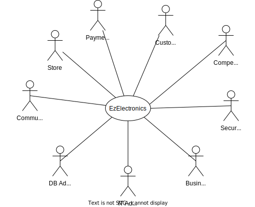

# Requirements Document - current EZElectronics

Date:

Version: V1 - description of EZElectronics in CURRENT form (as received by teachers)

| Version number | Change |
| :------------: | :----: |
|                |        |

# Contents

-   [Requirements Document - current EZElectronics](#requirements-document---current-ezelectronics)
-   [Contents](#contents)
-   [Informal description](#informal-description)
-   [Stakeholders](#stakeholders)
-   [Context Diagram and interfaces](#context-diagram-and-interfaces)
    -   [Context Diagram](#context-diagram)
    -   [Interfaces](#interfaces)
-   [Stories and personas](#stories-and-personas)
-   [Functional and non functional requirements](#functional-and-non-functional-requirements)
    -   [Functional Requirements](#functional-requirements)
    -   [Non Functional Requirements](#non-functional-requirements)
-   [Use case diagram and use cases](#use-case-diagram-and-use-cases)
    -   [Use case diagram](#use-case-diagram)
        -   [Use case 1, UC1 Authenticate](#use-case-1-uc1-authenticate)
            -   [Scenario 1.1](#scenario-11)
            -   [Scenario 1.2](#scenario-12)
            -   [Scenario 1.x](#scenario-1x)
        -   [Use case 2, UC2](#use-case-2-uc2)
        -   [Use case x, UCx](#use-case-x-ucx)
-   [Glossary](#glossary)
-   [System Design](#system-design)
-   [Deployment Diagram](#deployment-diagram)

# Informal description

EZElectronics (read EaSy Electronics) is a software application designed to help managers of electronics stores to manage their products and offer them to customers through a dedicated website. Managers can assess the available products, record new ones, and confirm purchases. Customers can see available products, add them to a cart and see the history of their past purchases.

# Stakeholders

|          Stakeholder name           |                                                                Description                                                                |
| :---------------------------------: | :---------------------------------------------------------------------------------------------------------------------------------------: |
|              Customers              |                                              The customer of the each electronic goods store                                              |
|               Admins                | IT administrator, Business administrator, Security Manager, DB Administrator, Community Moderator (for inappropriate description/reviews) |
|        Physical Goods Store         |                                             Each of the electronics store, seen as an entity                                              |
|           Payment Service           |                                                          PayPal/VISA/Mastercard                                                           |
| Google Play Store & Apple App Store |                                                      (legal + quality requirements)                                                       |
|             Competitors             |                                                             (Amazon/Ebay ...)                                                             |

<!-- FIXME: discuss this |           Shipping Agency           |                                                        One or more (FedEX, UPS...)                                                        | -->

# Context Diagram and interfaces

## Context Diagram

## Interfaces

\<describe here each interface in the context diagram>

\<GUIs will be described graphically in a separate document>

|                Actor                |                                                                 Logical Interface                                                                  | Physical Interface |
| :---------------------------------: | :------------------------------------------------------------------------------------------------------------------------------------------------: | :----------------: |
|              Customer               |                    GUI (to be defined -key functions: browse the electronics store, search for items, buy items, leave reviews)                    |   Smartphone/PC    |
|               Admins                |                                    GUI/TUI (to be defined -key functions: all functions + management functions)                                    |         PC         |
|          Electronics Store          | GUI (to be defined - key functions: manage the sales and visualize stats on them, get in direct contact with the Community Moderator for problems) |   Smartphone/PC    |
| Google Play Store & Apple App Store |                                       API (to be defined - key functions: handle the app submission process)                                       |      Internet      |

<!-- FIXME: not present in the v1 API |           Payment Service           |                                    API (to be defined - key functions: handle payments, refunds, and disputes)                                     |      Internet      | -->

# Stories and personas

\<A Persona is a realistic impersonation of an actor. Define here a few personas and describe in plain text how a persona interacts with the system>

\<Persona is-an-instance-of actor>

\<stories will be formalized later as scenarios in use cases>

# Functional and non functional requirements

## Functional Requirements

\<In the form DO SOMETHING, or VERB NOUN, describe high level capabilities of the system>

\<they match to high level use cases>

|  ID  |                                                                                   Description                                                                                    |
| :--: | :------------------------------------------------------------------------------------------------------------------------------------------------------------------------------: |
| FR1  |                                                                           Users can log in or log out                                                                            |
| FR2  |                                       The system must be able to check if the user is logged in, and if not, return a 401 error response​                                        |
| FR3  |                        The system must differentiate between customer and manager roles and allow access to specific functionalities based on these roles                        |
| FR4  |                   The system must allow logged-in customers to add products to their cart, ensuring the product ID is valid and the product has not been sold                    |
| FR5  |                                              The system must provide the ability to check out a cart, only if the cart is not empty                                              |
| FR6  |                                   The system must be able to return the purchase history of the logged-in customer, excluding the current cart                                   |
| FR7  |                                          The system must allow the removal of a product from the cart given a valid product ID and cart                                          |
| FR8  |                The system must allow managers to register new products with valid details such as code, model, category, selling price, and optional arrival date                |
| FR9  |            The system must permit the deletion of products by code and allow for the deletion of all products, the latter for testing purposes without authentication            |
| FR10 | The system must enable managers to register the arrival of proposed products, sell products, and retrieve products by different criteria such as code, category, and sold status |
| FR11 |                                                               managers can add, delete or update product listings                                                                |
| FR12 |                                          Customers can browse products based on various criteria like category, model, and availability                                          |
| FR14 |                                                              Customers can add products to their cart and checkout                                                               |
| FR17 |                                                               The system maintains a history of customer purchases                                                               |
| FR18 |                                                   The system provides role-based access control for different functionalities                                                    |

## Non Functional Requirements

\<Describe constraints on functional requirements>

|   ID    | Type (efficiency, reliability, ..) |                                                   Description                                                    | Refers to  |
| :-----: | :--------------------------------: | :--------------------------------------------------------------------------------------------------------------: | :--------: |
|  NFR1   |             usability              | The system should be user-friendly and intuitive, with a response time of no more than 2 seconds for any action. | FR12, FR14 |
|  NFR2   |              security              |              User data should be encrypted, and secure login/logout processes must be implemented.               |  FR1, FR2  |
|  NFR3   |            reliability             |          The system should be available at 99.9% of the time with high backup and recovery procedures.           |  all FRs   |
|  NFR4   |            scalability             |   The system should handle up to x users and x number of products entries without degradations of performances   |  all FRs   |
| NFRx .. |                                    |                                                                                                                  |            |

# Use case diagram and use cases

## Use case diagram

\<define here UML Use case diagram UCD summarizing all use cases, and their relationships>

\<next describe here each use case in the UCD>

### Use case 1, UC1 Authenticate

| Actors Involved  |                             User                             |
| :--------------: | :----------------------------------------------------------: |
|   Precondition   |                     User has an account                      |
|  Post condition  |                User is logged in his account                 |
| Nominal Scenario | User insert username and password to log in into his account |
|     Variants     |            User can log in as costumer or manager            |
|    Exceptions    |                       Error for log in                       |

##### Scenario 1.1

\<describe here scenarios instances of UC1>

\<a scenario is a sequence of steps that corresponds to a particular execution of one use case>

\<a scenario is a more formal description of a story>

\<only relevant scenarios should be described>

|  Scenario 1.1  |                                                                            |
| :------------: | :------------------------------------------------------------------------: |
|  Precondition  | \<Boolean expression, must evaluate to true before the scenario can start> |
| Post condition |  \<Boolean expression, must evaluate to true after scenario is finished>   |
|     Step#      |                                Description                                 |
|       1        |                                                                            |
|       2        |                                                                            |
|      ...       |                                                                            |

##### Scenario 1.2

##### Scenario 1.x

### Use case 2, UC2

..

### Use case x, UCx

..

# Glossary

\<use UML class diagram to define important terms, or concepts in the domain of the application, and their relationships>

\<concepts must be used consistently all over the document, ex in use cases, requirements etc>

# System Design

\<describe here system design>

\<must be consistent with Context diagram>

# Deployment Diagram

\<describe here deployment diagram >
