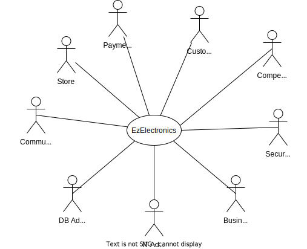

# Requirements Document - current EZElectronics

Date:

Version: V1 - description of EZElectronics in CURRENT form (as received by teachers)

| Version number | Change |
| :------------: | :----: |
|                |        |

## Contents

- [Requirements Document - current EZElectronics](#requirements-document---current-ezelectronics)
  - [Contents](#contents)
  - [Informal description](#informal-description)
  - [Stakeholders](#stakeholders)
  - [Context Diagram and interfaces](#context-diagram-and-interfaces)
    - [Context Diagram](#context-diagram)
    - [Interfaces](#interfaces)
  - [Stories and personas](#stories-and-personas)
  - [Functional and non-functional requirements](#functional-and-non-functional-requirements)
    - [Functional Requirements](#functional-requirements)
  - [Use case diagram and use cases](#use-case-diagram-and-use-cases)
    - [Use case diagram](#use-case-diagram)
    - [UC1 - Log In](#uc1---log-in)
      - [Scenario 1.1 | User logs in into his account as Customer |](#scenario-11--user-logs-in-into-his-account-as-customer-)
        - [Exception 1.1.2.a | Credential Error |](#exception-112a--credential-error-)
      - [Scenario 1.2 | User logs in into his account as Manager |](#scenario-12--user-logs-in-into-his-account-as-manager-)
        - [Exception 1.2.2.a | Credential Error |](#exception-122a--credential-error-)
    - [UC2 - Log Out](#uc2---log-out)
    - [UC3 - Sign Up](#uc3---sign-up)
    - [Scenario 4.2 | Sign-up exception: User already registered on the website |](#scenario-42--sign-up-exception-user-already-registered-on-the-website-)
    - [Scenario 4.3 | Sign-up exception: User violates password rules |](#scenario-43--sign-up-exception-user-violates-password-rules-)
    - [Scenario 4.4 | Sign-up exception: Error on e-mail |](#scenario-44--sign-up-exception-error-on-e-mail-)
  - [Glossary](#glossary)
  - [Deployment Diagram](#deployment-diagram)

## Informal description

EZElectronics (read EaSy Electronics) is a software application designed to help managers of electronics stores to manage their products and offer them to customers through a dedicated website. Managers can assess the available products, record new ones, and confirm purchases. Customers can see available products, add them to a cart and see the history of their past purchases.

## Stakeholders

|          Stakeholder name           |                                                                Description                                                                |
| :---------------------------------: | :---------------------------------------------------------------------------------------------------------------------------------------: |
|              Customers              |                                                The customer of each electronic goods store                                                |
|               Admins                |                                           IT administrator, Security Manager, DB Administrator                                            |
|               Manager               |                                                         Electronic store manager                                                          |
|               Admins                | IT administrator, Business administrator, Security Manager, DB Administrator, Community Moderator (for inappropriate description/reviews) |
|           Payment Service           |                                                          PayPal/VISA/Mastercard                                                           |
| Google Play Store & Apple App Store |                                                      (legal + quality requirements)                                                       |
|             Competitors             |                                                             (Amazon/Ebay ...)                                                             |
|           Shipping Agency           |                                                        One or more (FedEX, UPS...)                                                        |

## Context Diagram and interfaces

### Context Diagram

### Interfaces

\<describe here each interface in the context diagram>

\<GUIs will be described graphically in a separate document>

|                Actor                |                                                                 Logical Interface                                                                  | Physical Interface |
| :---------------------------------: | :------------------------------------------------------------------------------------------------------------------------------------------------: | :----------------: |
|              Customer               |                    GUI (to be defined -key functions: browse the electronics store, search for items, buy items, leave reviews)                    |   Smartphone/PC    |
|               Admins                |                                    GUI/TUI (to be defined -key functions: all functions + management functions)                                    |         PC         |
|               Manager               | GUI (to be defined - key functions: manage the sales and visualize stats on them, get in direct contact with the Community Moderator for problems) |   Smartphone/PC    |
| Google Play Store & Apple App Store |                                       API (to be defined - key functions: handle the app submission process)                                       |      Internet      |
|           Payment Service           |                                    API (to be defined - key functions: handle payments, refunds, and disputes)                                     |      Internet      |

## Stories and personas

\<A Persona is a realistic impersonation of an actor. Define here a few personas and describe in plain text how a persona interacts with the system>

\<Persona is-an-instance-of actor>

\<stories will be formalized later as scenarios in use cases>

## Functional and non-functional requirements

### Functional Requirements

\<In the form DO SOMETHING, or VERB NOUN, describe high level capabilities of the system>

\<they match to high level use cases>

|   ID    |                                                                                                  Description                                                                                                  |
| :-----: | :-----------------------------------------------------------------------------------------------------------------------------------------------------------------------------------------------------------: |
| **FR1** |                                                                                         **Authentication Management**                                                                                         |
|   1.1   |                                                                             _Users_ must be able to log in with their credentials                                                                             |
|   1.2   |                                                                                        _Users_ must be able to log out                                                                                        |
|   1.3   |                                                              The system must be able to retrieve information about the currently logged-in user                                                               |
|   1.4   |                                                 Support multiple Multi-Factor Authentication methods including  including SMS, email.                                                  |
|   1.5   |                                                                      Users must reset passwords securely via email or SMS verification.                                                                       |
|   1.6   |                                               Passwords must be at least 8 characters long with uppercase, lowercase letters, numbers, and special characters.                                                |
|   1.7   |                                                              User accounts should lock for 5 minutes after 5 consecutive failed login attempts.                                                               |
| **FR2** |                                                                                              **User Management**                                                                                              |
|   2.1   |                                                                                The system must be able to register a new user                                                                                 |
|   2.2   |                                                                          The system must be able to provide a list of all the users                                                                           |
|   2.3   |                                                               The system must be able to provide a list of all the users with a specified role                                                                |
|   2.4   |                             Allow users to update their profile information, such as name, surname,email and password, to ensure accuracy and security of their account details.                              |
|   2.5   |                                   Require email verification for user registration to ensure that users provide valid email addresses and to prevent spam or fake accounts.                                   |
|   2.6   |                        Provide functionality to search for users based on criteria such as username, name, surname, or role, enabling administrators to manage users more efficiently.                        |
|   2.7   |                                        Allow administrators to deactivate or permanently delete user accounts, when necessary  such as in cases of policy violations.                                         |
|   2.8   |                                                                                   Allow managers to see the sales history.                                                                                    |
|   2.9   |                                                                                       show Legal constarints(GDPR,EULA)                                                                                       |
|  2.10   |                                                                               Ask users premissions for personal data treatment                                                                               |
| **FR3** |                                                                                            **Product Management**                                                                                             |
|   3.1   |                                                           _Managers_ must be able to register a new product that doesn't exist yet in the Database                                                            |
|   3.2   |                                                            _Managers_ must be able to register the arrival of a set of products of the same model                                                             |
|   3.3   |                                                                              _Managers_ must be able to mark a product as `sold`                                                                              |
|   3.4   |                                                                  The system must be able to return all the products present in the Database                                                                   |
|   3.5   |                                                                       The system must be able to return a product given its unique code                                                                       |
|   3.6   |                                                                    The system must be able to return all products of a specified category                                                                     |
|   3.7   |                                                                      The system must be able to return all products of a specified model                                                                      |
|   3.8   |                        Enable managers to upload product images to enhance the visual presentation of products on the website and provide customers with a better shopping experience.                        |
|   3.9   |               Allow customers to submit reviews and ratings for products they have purchased, providing valuable feedback for both customers and managers and influencing purchasing decisions.               |
|  3.10   |                      Implement product recommendation features based on customer browsing and purchasing history to suggest relevant products and increase cross-selling opportunities.                       |
|  3.11   |                                                                     The system must be able to return all products of a specified brand.                                                                      |
|  3.12   |                                                                  The system must be able to return all products in a specified price range.                                                                   |
|  3.13   |                           Allow managers to edit existing product information such as selling price, model, category, and details to keep product listings accurate and up-to-date.                           |
|  3.14   |                                     Implement inventory management features to track the quantity of each product in stock, allowing managers to adjust inventory levels.                                     |
|  3.15   |            Display the availability status of each product (e.g., "In Stock", "Out of Stock") on the product listing page to inform customers about product availability before making a purchase.            |
| **FR4** |                                                                                              **Cart Management**                                                                                              |
|   4.1   |                                                                  The system must be able to return the cart of the currently logged-in user                                                                   |
|   4.2   |                                                                          Logged-in users must be able to add a product to their cart                                                                          |
|   4.3   |                                                                   Logged-in _Customers_ must be able to pay the total amount of their cart                                                                    |
|   4.4   |                                                                      Logged-in _Customers_ must be able to view their purchasing history                                                                      |
|   4.5   |                                                                    Logged-in _Customers_ must be able to delete a product from their cart                                                                     |
|   4.6   |                                                                            Logged-in _Customers_ must be able to reset their cart                                                                             |
|   4.7   |                                     Multiple Payment Options: Offer a variety of payment methods to users during checkout, including credit/debit cards, digital wallets.                                     |
|   4.8   | Provide users with immediate confirmation of successful payment transactions, including order summaries, receipt details, and transaction IDs, to instill confidence and transparency in the payment process. |
<!-- TODO: legal constraints, GDPR, etc

### Non-Functional Requirements

<!-- TODO: Define non-functional requirements -->

|   ID    |    Type     |                                                   Description                                                    | Refers to  |
| :-----: | :---------: | :--------------------------------------------------------------------------------------------------------------: | :--------: |
|  NFR1   |  usability  | The system should be user-friendly and intuitive, with a response time of no more than 2 seconds for any action. | FR12, FR14 |
|  NFR2   |  security   |              User data should be encrypted, and secure login/logout processes must be implemented.               |  FR1, FR2  |
|  NFR3   | reliability |          The system should be available at 99.9% of the time with high backup and recovery procedures.           |  all FRs   |
|  NFR4   | scalability |   The system should handle up to x users and x number of products entries without degradations of performances   |  all FRs   |
| NFRx .. |             |                                                                                                                  |            |

## Use case diagram and use cases

Use cases are ordered as follows: UCx where x is the use case number, if a more
than one nominal scenario is present, each scenario is ordered as x.y where y is
the scenario number. If only one scenario is present, the scenario number
corresponds to the use case number. If an exception and/or a variant is present,
it is ordered as [SCENARIO#].z.a where z is the step where the exception/variant
occurs, and a is a letter that identifies the exception/variant.

### Use case diagram

\<define here UML Use case diagram UCD summarizing all use cases, and their relationships>

\<next describe here each use case in the UCD>

<!-- Only valuable fields are mentioned here to reduce clutter -->

### UC1 - Log In

-   **Actors involved**: User
-   **Informal Description**: User logs in into his account
-   **Pre-condition**: User has an account either as a Customer or as a Manager
-   **Post-condition**: User is logged in his account
-   **Nominal Scenarios**: [1.1, 1.2]
-   **Exceptions**: [1.1.2.a, 1.2.2.a]

#### Scenario 1.1 | User logs in into his account as Customer |

-   **Precondition**: User has an account as Customer
-   **Post condition**: User is logged into his account as Customer

| Step# |                 Actor                  |                        System                        |
| :---: | :------------------------------------: | :--------------------------------------------------: |
|   1   | Customer inserts username and password |                          /                           |
|   2   |                   /                    | Found matching username and password in the Database |

##### Exception 1.1.2.a | Credential Error |

|    Step#     | Actor |                         System                          |
| :----------: | :---: | :-----------------------------------------------------: |
|     2.a      |   /   | Matching username or password not found in the Database |
| Go to step 1 |   /   |                            /                            |

#### Scenario 1.2 | User logs in into his account as Manager |

-   **Precondition**: User has an account as Manager
-   **Post condition**: User is logged into his account as Manager

| Step# |                 Actor                 |                       System                        |
| :---: | :-----------------------------------: | :-------------------------------------------------: |
|   1   | Manager inserts username and password |                          /                          |
|   2   |                   /                   | Find matching username and password in the Database |
|   3   |                   /                   |          User is authenticated as Manager           |

##### Exception 1.2.2.a | Credential Error |

|    Step#     | Actor |                         System                          |
| :----------: | :---: | :-----------------------------------------------------: |
|     2.a      |   /   | Matching username or password not found in the Database |
| Go to step 1 |   /   |                            /                            |

### UC2 - Log Out

-   **Actors involved**: User
-   **Informal Description**: User logs out
-   **Pre-condition**: User is logged in his account
-   **Post-condition**: User is logged out from his account

| Step# |             Actor             |        System        |
| :---: | :---------------------------: | :------------------: |
|   1   | User clicks on log out button |          /           |
|   2   |               /               | Ends session of user |

### UC3 - Sign Up

-   **Actors involved**: User
-   **Informal Description**: User registers a new account
-   **Post-condition**: User is registered
-   **Variants**:
-   **Exceptions**: [3.2, 3.3, 3.4]

| Step# |                           Actor                            |                           System                           |
| :---: | :--------------------------------------------------------: | :--------------------------------------------------------: |
|   1   |               User clicks on sign-up button                |                             /                              |
|   2   | User fills in: Name, Surname, email, username and password |                             /                              |
|   3   |                             /                              | Ensures that the nickname and email are not already taken  |
|   4   |                             /                              |         Ensures that chosen password matches rules         |
|   5   |                             /                              | Ensures that confirmation password matches chosen password |
|   6   |                             /                              |             Sends e-mail with verification key             |
|   7   |    Pastes verification key into the corresponding field    |                             /                              |
|   8   |                             /                              |         Ensures that verification key corresponds          |
|   9   |                             /                              |                       Displays EULA                        |
|  10   |                     User accepts EULA                      |                             /                              |
|  11   |                             /                              | Log-in the newly created account and refresh page to home  |

### Scenario 4.2 | Sign-up exception: User already registered on the website |

| :------------: | :-------------------------------------------------------: |
| Precondition | User does have an account |
| Post condition | |

| Step# |             Actor             |              System              |
| :---: | :---------------------------: | :------------------------------: |
|   1   | User fills in: Name, Surname, |                                  |
|       |  e-mail, username, password   |                                  |
|   2   |                               | Check if the username is already |
|       |                               |     registered, match found      |
|       |                               |                                  |
|   3   |                               |      Notify user, error 409      |

### Scenario 4.3 | Sign-up exception: User violates password rules |

| :------------: | :---------------------------------------------------------------------: |
| Precondition | User does not have an account, user insert an incorrect password format |
| Post condition | |

| Step# |             Actor             |                 System                  |
| :---: | :---------------------------: | :-------------------------------------: |
|   1   | User fills in: Name, Surname, |                                         |
|       |  e-mail, username, password   |                                         |
|   2   |                               |    Check if the username is already     |
|       |                               |       registered, no match found        |
|       |                               |                                         |
|   3   |                               | Check for password rules, not satisfied |
|       |                               |                                         |
|   4   |                               |  Error signaled "respect format rules"  |

### Scenario 4.4 | Sign-up exception: Error on e-mail |

| :------------: | :------------------------------------------------------------: |
| Precondition | User does not have an account, user insert an incorrect e-mail |
| Post condition | |

| Step# |             Actor             |               System                |
| :---: | :---------------------------: | :---------------------------------: |
|   1   | User fills in: Name, Surname, |                                     |
|       |  e-mail, username, password   |                                     |
|   2   |                               |  Check if the username is already   |
|       |                               |     registered, no match found      |
|       |                               |                                     |
|   3   |                               | Check for password rules, satisfied |
|       |                               |                                     |
|   4   |                               | Sends e-mail with verification key  |
|       |                               |                                     |
|   5   |     Do not receive e-mail     |                                     |
|       |                               |                                     |
|   6   |                               |           Process aborts            |

## Glossary

\<use UML class diagram to define important terms, or concepts in the domain of the application, and their relationships>

\<concepts must be used consistently all over the document, ex in use cases, requirements etc>

<!--
FIXME: not necessary

# System Design

\<describe here system design>

\<must be consistent with Context diagram> -->

## Deployment Diagram

