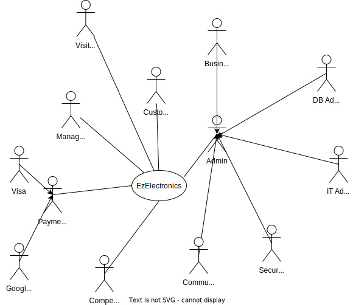
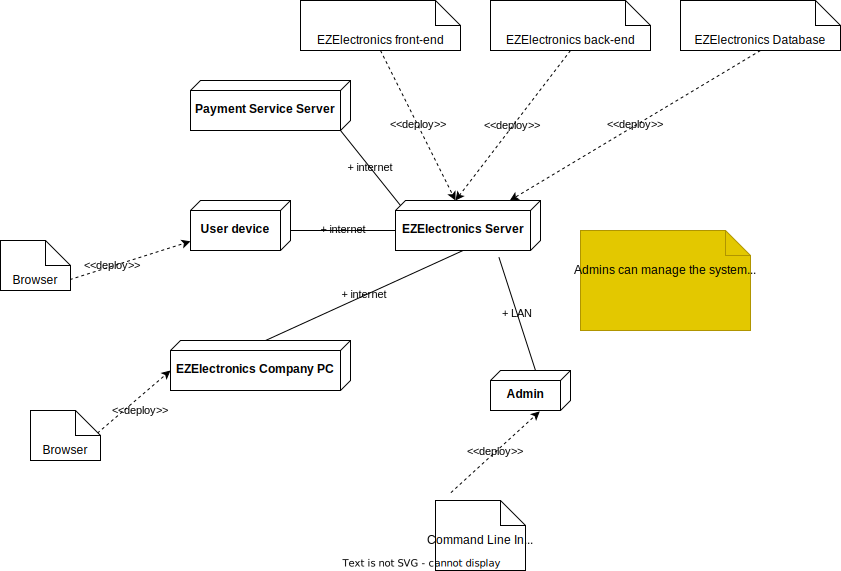

# Requirements Document - future EZElectronics

Date: 2024-05-01

| Version number |                                                                                                                                                           Change                                                                                                                                                           |
| :------------: | :------------------------------------------------------------------------------------------------------------------------------------------------------------------------------------------------------------------------------------------------------------------------------------------------------------------------: |
|       2        | Fixed general issues on APIs and fixed corresponding table of access rights, this leads to a better formalization of the `Admin` figure, rethought about possible stakeholders and corresponding actors, added a number of use cases for quality-of-life improvements like automatically generating products code as UUIDs |

## Contents

- [Requirements Document - future EZElectronics](#requirements-document---future-ezelectronics)
  - [Contents](#contents)
  - [Informal description](#informal-description)
  - [Stakeholders](#stakeholders)
  - [Context Diagram and interfaces](#context-diagram-and-interfaces)
    - [Context Diagram](#context-diagram)
    - [Interfaces](#interfaces)
  - [Stories and personas](#stories-and-personas)
  - [Functional and non-functional requirements](#functional-and-non-functional-requirements)
    - [Functional Requirements + Access Rights](#functional-requirements--access-rights)
    - [Non-Functional Requirements](#non-functional-requirements)
  - [Use case diagram and use cases](#use-case-diagram-and-use-cases)
    - [Use case diagram](#use-case-diagram)
    - [UC1 - Log In](#uc1---log-in)
      - [Scenario 1.1 | User logs in into his account as Customer |](#scenario-11--user-logs-in-into-his-account-as-customer-)
        - [Exception 1.1.2.a | Credential Error |](#exception-112a--credential-error-)
      - [Scenario 1.2 | User logs in into his account as Manager |](#scenario-12--user-logs-in-into-his-account-as-manager-)
        - [Exception 1.2.2.a | Credential Error |](#exception-122a--credential-error-)
    - [UC2 - Log Out](#uc2---log-out)
    - [UC3 - Sign Up](#uc3---sign-up)
    - [UC 4 - Customer Buys a Product](#uc-4---customer-buys-a-product)
      - [Variant 4.1a | User Chooses a Category |](#variant-41a--user-chooses-a-category-)
      - [Variant 4.1b | User Chooses a Brand |](#variant-41b--user-chooses-a-brand-)
      - [Variant 4.1c | User Chooses a Price Range |](#variant-41c--user-chooses-a-price-range-)
      - [Variant 4.3a | Customer adds product to wishlist |](#variant-43a--customer-adds-product-to-wishlist-)
      - [Variant 4.3b | Customer views the product page |](#variant-43b--customer-views-the-product-page-)
      - [Variant 4.5a | Customer views the wishlist |](#variant-45a--customer-views-the-wishlist-)
      - [Variant 4.7a | Empty Cart |](#variant-47a--empty-cart-)
      - [Variant 4.7b | Remove Item from Cart |](#variant-47b--remove-item-from-cart-)
      - [Variant 4.7c | Delete the Entire Cart |](#variant-47c--delete-the-entire-cart-)
      - [Variant 4.7d | Show Cart History |](#variant-47d--show-cart-history-)
    - [Exception 4.3a | User not logged in as Customer](#exception-43a--user-not-logged-in-as-customer)
      - [Exception 4.4a | Item Already in a Cart |](#exception-44a--item-already-in-a-cart-)
      - [Exception 4.8a | Product Already Sold |](#exception-48a--product-already-sold-)
    - [Exception 4.9a | Payment unsuccessful](#exception-49a--payment-unsuccessful)
    - [UC 5 - Manager Adds a Product](#uc-5---manager-adds-a-product)
      - [Scenario 5a | Manager adds a new product to the store |](#scenario-5a--manager-adds-a-new-product-to-the-store-)
        - [Exception 5a.3a | Arrival Date cannot be in the Future |](#exception-5a3a--arrival-date-cannot-be-in-the-future-)
      - [Scenario 5b | Manager adds a new set of products to the store |](#scenario-5b--manager-adds-a-new-set-of-products-to-the-store-)
        - [Exception 5b.3a | Arrival Date cannot be in the Future |](#exception-5b3a--arrival-date-cannot-be-in-the-future-)
    - [UC 6 - Manager Marks a Product as Sold](#uc-6---manager-marks-a-product-as-sold)
    - [UC 7 - Manager edit information of existing product](#uc-7---manager-edit-information-of-existing-product)
    - [UC 8 - DB Admin Deletes a User](#uc-8---db-admin-deletes-a-user)
      - [Variant 8.1a | Filter by Role |](#variant-81a--filter-by-role-)
      - [Variant 8.1b | Filter by Username |](#variant-81b--filter-by-username-)
    - [UC 9 - Customer submits rating and review](#uc-9---customer-submits-rating-and-review)
    - [UC 10 - Community Moderator Deletes a Review](#uc-10---community-moderator-deletes-a-review)
  - [Glossary](#glossary)
  - [Deployment Diagram](#deployment-diagram)

## Informal description

EZElectronics (read EaSy Electronics) is a software application designed to help managers of electronics stores to manage their products and offer them to customers through a dedicated website. Managers can assess the available products, record new ones, and confirm purchases. Customers can see available products, add them to a cart and see the history of their past purchases.

## Stakeholders

| Stakeholder name  |                                                                Description                                                                |
| :---------------: | :---------------------------------------------------------------------------------------------------------------------------------------: |
|     Customers     |                                                The customer of each electronic goods store                                                |
|      Admins       |                                           IT administrator, Security Manager, DB Administrator                                            |
|      Visitor      |                        Considered like a customer that is not logged in, will be prompted to log in to add to cart                        |
|      Manager      |                                                         Electronic store manager                                                          |
|      Admins       | IT administrator, Business administrator, Security Manager, DB Administrator, Community Moderator (for inappropriate description/reviews) |
|  Payment Service  |                                                          PayPal/VISA/Mastercard                                                           |
|    Competitors    |                                                             (Amazon/eBay ...)                                                             |
|  Shipping Agency  |                                                        One or more (FedEx, UPS...)                                                        |
| Product Suppliers |                                                 Manufacturers, Distributors, Wholesalers                                                  |
| Legal Authorities |        GDPR, EULA, Consumer Protection Laws, Tax Authorities, Data Protection Authorities, Intellectual Property Authorities, etc.        |
|     Investors     |                                                  People who have invested in the company                                                  |

## Context Diagram and interfaces

### Context Diagram

### Interfaces

|      Actor      |                                                                 Logical Interface                                                                  | Physical Interface |
| :-------------: | :------------------------------------------------------------------------------------------------------------------------------------------------: | :----------------: |
|    Customer     |                    GUI (to be defined -key functions: browse the electronics store, search for items, buy items, leave reviews)                    |   Smartphone/PC    |
|     Admins      |                                    GUI/TUI (to be defined -key functions: all functions + management functions)                                    |         PC         |
|     Visitor     |                                                 GUI (same as customer, but with limited functions)                                                 |   Smartphone/PC    |
|     Manager     | GUI (to be defined - key functions: manage the sales and visualize stats on them, get in direct contact with the Community Moderator for problems) |   Smartphone/PC    |
| Payment Service |                                    API (to be defined - key functions: handle payments, refunds, and disputes)                                     |      Internet      |

## Stories and personas

|    Persona    |                                                                                                                                                                                                                                Story                                                                                                                                                                                                                                |
| :-----------: | :-----------------------------------------------------------------------------------------------------------------------------------------------------------------------------------------------------------------------------------------------------------------------------------------------------------------------------------------------------------------------------------------------------------------------------------------------------------------: |
| Manager Susan |                                                                                                                              Susan is an efficient and organized manager of an electronics store, today she received a new shipment for an XPS 13, she registers the product in the Laptop category and puts today as the arrival date                                                                                                                              |
| Customer Jhon | Jhon is a customer interested in changing his old laptop, he goes to the EZElectronics website, he clicks on the Laptop category but he's overwhelmed by the choice, "maybe the website could be improved with a way to suggest me something for my needs" he wonders, after reading a bit online he comes to the conclusion that XPS 13 is the laptop of his choice, he searches for the model, clicks the add to cart button and then clicks the purchase button. |

## Functional and non-functional requirements

### Functional Requirements + Access Rights

|   ID    |                                                      Description                                                      |
| :-----: | :-------------------------------------------------------------------------------------------------------------------: |
| **FR1** |                                             **Authentication Management**                                             |
|   1.1   |                                _Users_ must be able to log in with their credentials.                                 |
|   1.2   |                                           _Users_ must be able to log out.                                            |
|   1.3   |                 The system must be able to retrieve information about the currently logged-in _user_.                 |
|   1.4   |                      Support multiple Multi-Factor Authentication methods including SMS, email.                       |
|   1.5   |                         _Users_ must reset passwords securely via email or SMS verification.                          |
|   1.6   | Passwords must be at least 8 characters long including uppercase, lowercase letters, numbers, and special characters. |
|   1.7   |                 _User_ accounts should lock for 5 minutes after 5 consecutive failed login attempts.                  |
| **FR2** |                                                  **User Management**                                                  |
|   2.1   |                                   The system must be able to register a new _user_                                    |
|   2.2   |                             The system must be able to provide a list of all the _users_                              |
|   2.3   |                  The system must be able to provide a list of all the _users_ with a specified role                   |
|   2.4   |               _Users_ can update their profile information, such as name, surname, email and password.                |
|   2.5   |                           The system will require an email verification via OTP validation.                           |
|   2.6   |                  _Managers_ must be able to search users by name, surname, email, username or role.                   |
|   2.7   |            _Admins_ must be able to ban users, temporarily or permanently, in cases of policy violations.             |
|   2.8   |                                       Allow managers to see the sales history.                                        |
|   2.9   |                                       Show Legal constraints (GDPR, EULA, ...)                                        |
|  2.10   |                                  Ask _users_ permissions for personal data treatment                                  |
|  2.11   |                                 _Community Moderators_ must be able to delete reviews                                 |
| **FR3** |                                                **Product Management**                                                 |
|   3.1   |               _Managers_ must be able to register a new product that doesn't exist yet in the Database.               |
|   3.2   |                _Managers_ must be able to register the arrival of a set of products of the same model.                |
|   3.3   |                                 _Managers_ must be able to mark a product as `sold`.                                  |
|   3.4   |                      The system must be able to return all the products present in the Database.                      |
|   3.6   |                        The system must be able to return all products of a specified category.                        |
|   3.7   |                         The system must be able to return all products of a specified model.                          |
|   3.8   |                                   _Managers_ must be able to upload product images.                                   |
|   3.9   |                   _Customers_ must be able to submit reviews and ratings for the product purchased.                   |
|  3.10   |           The system must implement product recommendation features based on _customer_ purchasing history.           |
|  3.11   |                         The system must be able to return all products of a specified brand.                          |
|  3.12   |                      The system must be able to return all products in a specified price range.                       |
|  3.13   |   _Managers_ must be able to edit existing product information such as selling price, model, category, and details.   |
|  3.14   |         The system must implement inventory management features allowing managers to adjust inventory levels.         |
|  3.15   |                             _Customers_ must be able to add a product to their wishlist.                              |
|  3.16  |             The system must display the availability status of each product on the product listing page.              |
| **FR4** |                                                  **Cart Management**                                                  |
|   4.1   |                      The system must be able to return the cart of the currently logged-in user.                      |
|   4.2   |                            Logged-in _users_ must be able to add a product to their cart.                             |
|   4.3   |                       Logged-in _Customers_ must be able to pay the total amount of their cart.                       |
|   4.4   |                         Logged-in _Customers_ must be able to view their purchasing history.                          |
|   4.5   |                        Logged-in _Customers_ must be able to delete a product from their cart.                        |
|   4.6   |                                Logged-in _Customers_ must be able to reset their cart.                                |
|   4.7   |    The system must offer different payment methods during checkout, including credit/debit cards, digital wallets.    |
|   4.8   |                The system must provide costumers with confirmation of successful payment transactions.                |

### Non-Functional Requirements

|    ID    |      Type       |                                                            Description                                                             |                                     Refers to                                     |
| :------: | :-------------: | :--------------------------------------------------------------------------------------------------------------------------------: | :-------------------------------------------------------------------------------: |
| **NFR1** | **performance** |                                                                                                                                    |                                                                                   |
|  NFR1.1  |                 |                     All API responses should be returned within 500 milliseconds under normal load conditions.                     |          FR3.1,FR3.2, FR3.3,FR3.4,FR3.5,FR3.6,FR3.7,FR1.1, FR1.2, FR1.3           |
|  NFR1.2  |                 |                  The system must support handling up to 10,000 concurrent users without performance degradation.                   |                               FR1.1, FR1.2, FR1.32                                |
|  NFR1.3  |                 |      Response time for retrieving product and user information should not exceed 2 seconds under normal operation conditions.      |                                 FR3.5,FR4.1,FR2.2                                 |
|  NFR1.4  |                 |                     Transforming large amounts of data should be fast and not use too much internet bandwidth.                     |                  FR3.1, FR3.2, FR3.3, FR3.4, FR3.5, FR3.6, FR3.7                  |
| **NFR2** | **scalability** |                                                                                                                                    |                                                                                   |
|  NFR2.1  |                 |             The system should be scalable to accommodate increased traffic, supporting automatic scaling of resources              |                         FR2.1, FR2.2, FR2.3, FR2.4, FR2.5                         |
|  NFR2.2  |                 |                  Database queries must be optimized to handle large data volumes and complex queries efficiently.                  | FR2.1, FR2.2, FR2.3, FR2.4, FR2.5, FR3.1, FR3.2, FR3.3, FR3.4, FR3.5, FR3.6,FR3.7 |
|  NFR2.3  |                 |             The system should manage up to 10,000 products and handle 1,000 users at the same time without any issues.             |                                    FR3.4,FR4.2                                    |
| **NFR3** | **Reliability** |                                                                                                                                    |                                                                                   |
|  NFR3.1  |                 |                                             The system should aim for a 99.99% uptime                                              |                                FR1.1, FR1.2, FR1.3                                |
|  NFR3.2  |                 |        The system should handle software and hardware failures gracefully without losing user data or major functionality.         |                            All functional requirements                            |
| **NFR4** |  **Security**   |                                                                                                                                    |                                                                                   |
|  NFR4.1  |                 |                                All data exchanges between the client and server must be encrypted.                                 |                                FR1.1, FR1.2, FR1.3                                |
|  NFR4.2  |                 |                    The system undergoes frequent security reviews to identify and correct any vulnerabilities.                     |                                    FR1.1,FR1.2                                    |
| **NFR5** |  **Usability**  |                                                                                                                                    |                                                                                   |
|  NFR5.1  |                 | All API endpoints must provide meaningful error messages that accurately describe the error conditions and suggest possible fixes. |                         FR2.1, FR2.2, FR2.3, FR2.4, FR2.5                         |
|  NFR5.2  |                 |           The API documentation must be clear, complete, and accessible online with examples of requests and responses.            |                                  FR4.1 to FR4.6                                   |
|  NFR5.3  |                 |                  The system looks good and works well on any device, whether it's a computer, tablet, or mobile.                   |                            All functioanl requirements                            |
| **NFR6** | **Testability** |                                                                                                                                    |                                                                                   |
|  NFR6.1  |                 |        The API should support automated testing environments with capabilities for integration, load, and security testing.        |                                  FR4.1 to FR4.6                                   |
|  NFR6.2  |                 |                      Provide a sandbox environment for testing API integrations without affecting live data.                       |                                  FR4.1 to FR4.6                                   |
|  NFR6.3  |                 |         The system keeps detailed records of its performance and any problems that occur, making it easier to fix issues.          |                            All functional requirements                            |

## Use case diagram and use cases

Use cases are ordered as follows: UCx where x is the use case number, if a more
than one nominal scenario is present, each scenario is ordered as x.y where y is
the scenario number. If only one scenario is present, the scenario number
corresponds to the use case number. If an exception and/or a variant is present,
it is ordered as [SCENARIO#].z.a where z is the step where the exception/variant
occurs, and a is a letter that identifies the exception/variant.

### Use case diagram

### UC1 - Log In

-   **Actors involved**: User
-   **Informal Description**: User logs in into his account
-   **Pre-condition**: User has an account either as a Customer or as a Manager
-   **Post-condition**: User is logged in his account
-   **Nominal Scenarios**: [1.1, 1.2]
-   **Exceptions**: [1.1.2.a, 1.2.2.a]

#### Scenario 1.1 | User logs in into his account as Customer |

-   **Precondition**: User has an account as Customer
-   **Post condition**: User is logged into his account as Customer

| Step# |                 Actor                  |                        System                        |
| :---: | :------------------------------------: | :--------------------------------------------------: |
|   1   | Customer inserts username and password |                                                      |
|   2   |                                        | Found matching username and password in the Database |

##### Exception 1.1.2.a | Credential Error |

|    Step#     | Actor |                         System                          |
| :----------: | :---: | :-----------------------------------------------------: |
|     2.a      |       | Matching username or password not found in the Database |
| Go to step 1 |       |                                                         |

#### Scenario 1.2 | User logs in into his account as Manager |

-   **Precondition**: User has an account as Manager
-   **Post condition**: User is logged into his account as Manager

| Step# |                 Actor                 |                       System                        |
| :---: | :-----------------------------------: | :-------------------------------------------------: |
|   1   | Manager inserts username and password |                                                     |
|   2   |                                       | Find matching username and password in the Database |
|   3   |                                       |          User is authenticated as Manager           |

##### Exception 1.2.2.a | Credential Error |

|    Step#     | Actor |                         System                          |
| :----------: | :---: | :-----------------------------------------------------: |
|     2.a      |       | Matching username or password not found in the Database |
| Go to step 1 |       |                                                         |

### UC2 - Log Out

-   **Actors involved**: User
-   **Informal Description**: User logs out
-   **Pre-condition**: User is logged in his account
-   **Post-condition**: User is logged out from his account

| Step# |             Actor             |        System        |
| :---: | :---------------------------: | :------------------: |
|   1   | User clicks on log out button |                      |
|   2   |                               | Ends session of user |

### UC3 - Sign Up

-   **Actors involved**: User
-   **Informal Description**: User registers a new account
-   **Post-condition**: User is registered
-   **Variants**:
-   **Exceptions**: [3.2, 3.3, 3.4]

| Step# |                           Actor                            |                           System                           |
| :---: | :--------------------------------------------------------: | :--------------------------------------------------------: |
|   1   |               User clicks on sign-up button                |                                                            |
|   2   | User fills in: Name, Surname, email, username and password |                                                            |
|   3   |                                                            | Ensures that the nickname and email are not already taken  |
|   4   |                                                            |         Ensures that chosen password matches rules         |
|   5   |                                                            | Ensures that confirmation password matches chosen password |
|   6   |                                                            |             Sends e-mail with verification key             |
|   7   |    Pastes verification key into the corresponding field    |                                                            |
|   8   |                                                            |         Ensures that verification key corresponds          |
|   9   |                                                            |                       Displays EULA                        |
|  10   |                     User accepts EULA                      |                                                            |
|  11   |                                                            | Log-in the newly created account and refresh page to home  |

### UC 4 - Customer Buys a Product

-   **Actors involved**: User, Customer, Manager
-   **Informal Description**: User browses the website to buy a product, adds the item to the cart and clicks on the purchase button
-   **Post-condition**: Customer has bought the product
-   **Variants**: [4.1a, 4.3a, 4.3b, 4.5a, 4.7a, 4.7b, 4.7c]
-   **Exceptions**: [4.3a, 4.4a, 4.8a, 4.9a]

|                 Step#                  |                             Actor                              |                       System                        |
| :------------------------------------: | :------------------------------------------------------------: | :-------------------------------------------------: |
|                   1                    |   User searches for a `product model` using the `search bar`   |                                                     |
|                   2                    |                                                                |   Displays all the products that match the query    |
|      Optionally go back to step 1      |                                                                |                                                     |
|                   3                    |   User clicks on `add to cart` button for a specific product   |                                                     |
|                   4                    |                                                                |       Adds the product to the customer's cart       |
|      Optionally go back to step 1      |                                                                |                                                     |
|                   5                    |               Customer clicks on the `cart` icon               |                                                     |
|                   6                    |                                                                |    Displays the cart with all the current items     |
|      Optionally go back to step 1      |                                                                |                                                     |
|                   7                    | Customer clicks on the `purchase` button in the cart interface |                                                     |
|                   8                    |                                                                | Item is purchased, and updates product availability |
|                   9                    |                                                                |       Notifies successful payment transaction       |
|                   10                   |                                                                |           Notify manager of the purchase            |
| Optionally go back to step 1 or end UC |                                                                |                                                     |

#### Variant 4.1a | User Chooses a Category |

|    Step#    |                 Actor                 | System |
| :---------: | :-----------------------------------: | :----: |
|     1a      | User selects a `category` from a list |        |
| Continue UC |                                       |        |

#### Variant 4.1b | User Chooses a Brand |

|    Step#    |               Actor                | System |
| :---------: | :--------------------------------: | :----: |
|     1b      | User selects a `brand` from a list |        |
| Continue UC |                                    |        |

#### Variant 4.1c | User Chooses a Price Range |

|    Step#    |                  Actor                   | System |
| :---------: | :--------------------------------------: | :----: |
|     1a      | User selects a `price range` from a list |        |
| Continue UC |                                          |        |

#### Variant 4.3a | Customer adds product to wishlist |

|       Step#       |                               Actor                                |                   System                    |
| :---------------: | :----------------------------------------------------------------: | :-----------------------------------------: |
|        3a         | Customer clicks on `add to wishlist` button for a specific product |                                             |
|        4a         |                                                                    | Adds the product to the customer's wishlist |
| Go back to step 3 |                                                                    |                                             |

#### Variant 4.3b | Customer views the product page |

|       Step#       |                           Actor                           |                     System                      |
| :---------------: | :-------------------------------------------------------: | :---------------------------------------------: |
|        3b         | Customer clicks on `product` panel for a specific product |                                                 |
|        4b         |                                                           | Shows product page with reviews and description |
| Go back to step 3 |                                                           |                                                 |

#### Variant 4.5a | Customer views the wishlist |

|    Step#    |                Actor                 |       System        |
| :---------: | :----------------------------------: | :-----------------: |
|     5a      | Customer clicks on `wishlist` button |                     |
|     4b      |                                      | Shows wishlist page |
| Continue UC |                                      |                     |

#### Variant 4.7a | Empty Cart |

|                 Step#                  | Actor |                                   System                                   |
| :------------------------------------: | :---: | :------------------------------------------------------------------------: |
|                   7a                   |       | Notifies the user that the cart is empty (`purchase` button not clickable) |
| Optionally go back to step 1 or end UC |       |                                                                            |

#### Variant 4.7b | Remove Item from Cart |

|    Step#     |                     Actor                     |             System             |
| :----------: | :-------------------------------------------: | :----------------------------: |
|      7b      | Customer clicks on `remove` button of an item |                                |
|      8b      |                                               | Removes the item from the cart |
| Go to step 6 |                                               |                                |

#### Variant 4.7c | Delete the Entire Cart |

|                 Step#                  |                  Actor                  |               System                |
| :------------------------------------: | :-------------------------------------: | :---------------------------------: |
|                   7c                   | Customer clicks on `delete cart` button |                                     |
|                   8c                   |                                         | Deletes all the items from the cart |
| Optionally go back to step 1 or end UC |                                         |                                     |

#### Variant 4.7d | Show Cart History |

|    Step#     |                     Actor                     |                  System                   |
| :----------: | :-------------------------------------------: | :---------------------------------------: |
|      7d      | Customer clicks on `show cart history` button |                                           |
|      8d      |                                               | Displays list of all past + current carts |
|      9d      |        Clicks on a cart from the list         |                                           |
| Go to step 6 |                                               |                                           |

### Exception 4.3a | User not logged in as Customer

|        Step#        | Actor |                    System                     |
| :-----------------: | :---: | :-------------------------------------------: |
|         3a          |       | Notify user that is not logged in as Customer |
| UC goes back to UC1 |       |                                               |

#### Exception 4.4a | Item Already in a Cart |

|    Step#    | Actor |                         System                          |
| :---------: | :---: | :-----------------------------------------------------: |
|     4a      |       | Notifies the user that the product is already in a cart |
| Continue UC |       |                                                         |

#### Exception 4.8a | Product Already Sold |

If the product availability is 0 when `purchase` button is clicked the system will send a message error, aborting the purchase process

|    Step#    | Actor |                         System                         |
| :---------: | :---: | :----------------------------------------------------: |
|     8a      |       | Notifies the user that the product is already sold out |
| Continue UC |       |                                                        |

### Exception 4.9a | Payment unsuccessful

If occurs an error in payment after verification on availability this exception will happen

|    Step#     | Actor |                     System                      |
| :----------: | :---: | :---------------------------------------------: |
|      9a      |       | Notifies user with error in payment transaction |
| Go to step 8 |       |                                                 |

### UC 5 - Manager Adds a Product

-   **Actors involved**: Manager
-   **Informal Description**: Manager adds a new product to his store
-   **Pre-condition**: Manager is logged in his account
-   **Post-condition**: Product(s) is(are) added to the store
-   **Nominal Scenario**: [5a, 5b]
-   **Exceptions**: [5a.3a, 5a.3b, 5b.3a]

#### Scenario 5a | Manager adds a new product to the store |

| Step# |                         Actor                          |              System              |
| :---: | :----------------------------------------------------: | :------------------------------: |
|   1   |         Manager clicks on `add product` button         |                                  |
|   2   | Manager fills in the product details and confirms them |                                  |
|   3   |                                                        | Adds the product in the Database |

##### Exception 5a.3a | Arrival Date cannot be in the Future |

|    Step#     | Actor |                               System                                |
| :----------: | :---: | :-----------------------------------------------------------------: |
|      3a      |       | Notifies the user that the `arrival date` is after the current date |
| Go to step 2 |       |                                                                     |

#### Scenario 5b | Manager adds a new set of products to the store |

| Step# |                                                     Actor                                                     |                  System                  |
| :---: | :-----------------------------------------------------------------------------------------------------------: | :--------------------------------------: |
|   1   |                                    Manager clicks on `add product` button                                     |                                          |
|   2   | Manager fills in the product details without specifying the product `code`, a `quantity` is specified instead |                                          |
|   3   |                                                                                                               | Adds the set of products in the Database |

##### Exception 5b.3a | Arrival Date cannot be in the Future |

|    Step#     | Actor |                               System                                |
| :----------: | :---: | :-----------------------------------------------------------------: |
|      3a      |       | Notifies the user that the `arrival date` is after the current date |
| Go to step 2 |       |                                                                     |

### UC 6 - Manager Marks a Product as Sold

-   **Actors involved**: Manager
-   **Informal Description**: Manager marks a product as sold
-   **Pre-condition**: Manager is logged in his account
-   **Post-condition**: Product is marked as sold
-   **Exceptions**: can't return error in code because it only shows products that
    are present in his account, selling date can't be after current date because of the
    constraints in insert product, given that arrival date is always before current date,
    the button is not clickable if the product is already sold, given that the manager
    is one there can't be errors in this instance

| Step# |                         Actor                         |                  System                   |
| :---: | :---------------------------------------------------: | :---------------------------------------: |
|   1   | Manager clicks on `mark as sold` button for a product |                                           |
|   2   |                                                       | Marks the product as sold in the Database |
|   3   |                                                       |  Decreases its availability accordingly   |

### UC 7 - Manager edit information of existing product

-   **Actors involved**: Manager
-   **Informal Description**: Manager edit information of existing product
-   **Pre-condition**: Manager must be logged in
-   **Post-condition**: Product information are modified
-   **Exceptions**: No exceptions can occur because system won't allow wrong images or strings format.

| Step# |                                          Actor                                           |                System                 |
| :---: | :--------------------------------------------------------------------------------------: | :-----------------------------------: |
|   1   |                             Manager clicks on `edit` button                              |                                       |
|   2   |                                                                                          | Displays the product information page |
|   3   | Manager edits product information (image, price, availability, model, category, details) |                                       |
|   4   |                                                                                          |        Updates Database status        |

### UC 8 - DB Admin Deletes a User

-   **Actors involved**: DB Admin
-   **Informal Description**: DB Admin deletes a user from the Database
-   **Pre-condition**: Operation is performed from the company PC by an authorized DB Admin
-   **Post-condition**: User is deleted from the Database
-   **Variants**: [8.1a, 8.1b]

| Step# |                      Actor                      |                  System                  |
| :---: | :---------------------------------------------: | :--------------------------------------: |
|   1   |     DB admin requests the list of all users     |                                          |
|   2   |                                                 | Displays the list of all the users in DB |
|   3   | DB admin selects a user to delete from the list |                                          |
|   4   |                                                 |    Deletes the user from the Database    |

#### Variant 8.1a | Filter by Role |

|    Step#    |                        Actor                        | System |
| :---------: | :-------------------------------------------------: | :----: |
|     1a      | DB admin selects a role to filter the list of users |        |
| Continue UC |                                                     |        |

#### Variant 8.1b | Filter by Username |

|    Step#    |                        Actor                        | System |
| :---------: | :-------------------------------------------------: | :----: |
|     1b      | DB admin searches for a specific username in the DB |        |
| Continue UC |                                                     |        |

### UC 9 - Customer submits rating and review

-   **Actors involved**: Customer
-   **Informal Description**: Customer submits rating and review of a purchased
-   **Pre-condition**: Customer is logged in and product model occurs at least one time in Customer's cart history
-   **Post-condition**: Customer submits rating and review for the product
-   **Exceptions**: No exceptions can occur because system won't allow wrong images or strings format.

| Step# |                                          Actor                                           |             System              |
| :---: | :--------------------------------------------------------------------------------------: | :-----------------------------: |
|   1   |                            Customer clicks on `review` button                            |                                 |
|   2   |                                                                                          | Displays Rating and Review page |
|   3   | Customer writes a review and add his rating for the product, optionally can add an image |                                 |
|   4   |                             Customer clicks on `post` button                             |                                 |
|   5   |                                                                                          |     Updates database status     |

### UC 10 - Community Moderator Deletes a Review

-   **Actors involved**: Community Moderator
-   **Informal Description**: Community Moderator deletes a review
-   **Pre-condition**: Community Moderator is logged in
-   **Post-condition**: Review is deleted

| Step# |                         Actor                          |                System                |
| :---: | :----------------------------------------------------: | :----------------------------------: |
|   1   | Moderator clicks on `delete` button on the review page |                                      |
|   2   |                                                        | Deletes the review from the Database |

## Glossary

## Deployment Diagram

