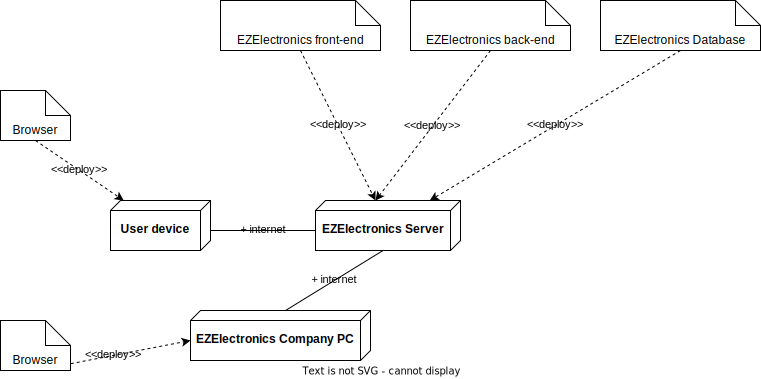

# Requirements Document - future EZElectronics

Date: 2024-05-01

| Version number |                                                                                                                                Change                                                                                                                                 |
| :------------: | :-------------------------------------------------------------------------------------------------------------------------------------------------------------------------------------------------------------------------------------------------------------------: |
|       2        | Fixed general issues on APIs and fixed corresponding table of access rights, this leads to a better formalization of the `Admin` figure, rethought about possible stakeholders and corresponding actors, added a number of use cases for quality-of-life improvements |

## Contents

-   [Requirements Document - future EZElectronics](#requirements-document---future-ezelectronics)
    -   [Contents](#contents)
    -   [Informal description](#informal-description)
    -   [Stakeholders](#stakeholders)
    -   [Context Diagram and interfaces](#context-diagram-and-interfaces)
        -   [Context Diagram](#context-diagram)
        -   [Interfaces](#interfaces)
    -   [Stories and personas](#stories-and-personas)
    -   [Functional and non-functional requirements](#functional-and-non-functional-requirements)
        -   [Functional Requirements + Access Rights](#functional-requirements--access-rights)
        -   [Non-Functional Requirements](#non-functional-requirements)
    -   [Use case diagram and use cases](#use-case-diagram-and-use-cases)
        -   [Use case diagram](#use-case-diagram)
        -   [UC1 - Log In](#uc1---log-in)
            -   [Scenario 1.1 | User logs in into his account as Customer |](#scenario-11--user-logs-in-into-his-account-as-customer-)
                -   [Exception 1.1.2.a | Credential Error |](#exception-112a--credential-error-)
            -   [Scenario 1.2 | User logs in into his account as Manager |](#scenario-12--user-logs-in-into-his-account-as-manager-)
                -   [Exception 1.2.2.a | Credential Error |](#exception-122a--credential-error-)
        -   [UC2 - Log Out](#uc2---log-out)
        -   [UC3 - Sign Up](#uc3---sign-up)
        -   [Scenario 4.2 | Sign-up exception: User already registered on the website |](#scenario-42--sign-up-exception-user-already-registered-on-the-website-)
        -   [Scenario 4.3 | Sign-up exception: User violates password rules |](#scenario-43--sign-up-exception-user-violates-password-rules-)
        -   [Scenario 4.4 | Sign-up exception: Error on e-mail |](#scenario-44--sign-up-exception-error-on-e-mail-)
    -   [Glossary](#glossary)
    -   [Deployment Diagram](#deployment-diagram)

## Informal description

EZElectronics (read EaSy Electronics) is a software application designed to help managers of electronics stores to manage their products and offer them to customers through a dedicated website. Managers can assess the available products, record new ones, and confirm purchases. Customers can see available products, add them to a cart and see the history of their past purchases.

## Stakeholders

|          Stakeholder name           |                                                                Description                                                                |
| :---------------------------------: | :---------------------------------------------------------------------------------------------------------------------------------------: | ------------- |
|              Customers              |                                                The customer of each electronic goods store                                                |
|               Admins                |                                           IT administrator, Security Manager, DB Administrator                                            |
|               Visitor               |                        Considered like a customer that is not logged in, will be prompted to log in to add to cart                        | Smartphone/PC |
|               Manager               |                                                         Electronic store manager                                                          |
|               Admins                | IT administrator, Business administrator, Security Manager, DB Administrator, Community Moderator (for inappropriate description/reviews) |
|           Payment Service           |                                                          PayPal/VISA/Mastercard                                                           |
| Google Play Store & Apple App Store |                                                      (legal + quality requirements)                                                       |
|             Competitors             |                                                             (Amazon/eBay ...)                                                             |
|           Shipping Agency           |                                                        One or more (FedEx, UPS...)                                                        |
|          Product Suppliers          |                                                 Manufacturers, Distributors, Wholesalers                                                  |
|          Legal Authorities          |        GDPR, EULA, Consumer Protection Laws, Tax Authorities, Data Protection Authorities, Intellectual Property Authorities, etc.        |

## Context Diagram and interfaces

### Context Diagram

### Interfaces

|                Actor                |                                                                 Logical Interface                                                                  | Physical Interface |
| :---------------------------------: | :------------------------------------------------------------------------------------------------------------------------------------------------: | :----------------: |
|              Customer               |                    GUI (to be defined -key functions: browse the electronics store, search for items, buy items, leave reviews)                    |   Smartphone/PC    |
|               Admins                |                                    GUI/TUI (to be defined -key functions: all functions + management functions)                                    |         PC         |
|               Visitor               |                                                 GUI (same as customer, but with limited functions)                                                 |   Smartphone/PC    |
|               Manager               | GUI (to be defined - key functions: manage the sales and visualize stats on them, get in direct contact with the Community Moderator for problems) |   Smartphone/PC    |
| Google Play Store & Apple App Store |                                       API (to be defined - key functions: handle the app submission process)                                       |      Internet      |
|           Payment Service           |                                    API (to be defined - key functions: handle payments, refunds, and disputes)                                     |      Internet      |

## Stories and personas

|    Persona    |                                                                                                                                                                                                                                Story                                                                                                                                                                                                                                |
| :-----------: | :-----------------------------------------------------------------------------------------------------------------------------------------------------------------------------------------------------------------------------------------------------------------------------------------------------------------------------------------------------------------------------------------------------------------------------------------------------------------: |
| Manager Susan |                                                                                                                              Susan is an efficient and organized manager of an electronics store, today she received a new shipment for an XPS 13, she registers the product in the Laptop category and puts today as the arrival date                                                                                                                              |
| Customer Jhon | Jhon is a customer interested in changing his old laptop, he goes to the EZElectronics website, he clicks on the Laptop category but he's overwhelmed by the choice, "maybe the website could be improved with a way to suggest me something for my needs" he wonders, after reading a bit online he comes to the conclusion that XPS 13 is the laptop of his choice, he searches for the model, clicks the add to cart button and then clicks the purchase button. |

## Functional and non-functional requirements

### Functional Requirements + Access Rights

<!-- TODO: access rights -->

|   ID    |                                                      Description                                                      |
| :-----: | :-------------------------------------------------------------------------------------------------------------------: |
| **FR1** |                                             **Authentication Management**                                             |
|   1.1   |                                _Users_ must be able to log in with their credentials.                                 |
|   1.2   |                                           _Users_ must be able to log out.                                            |
|   1.3   |                 The system must be able to retrieve information about the currently logged-in _user_.                 |
|   1.4   |                      Support multiple Multi-Factor Authentication methods including SMS, email.                       |
|   1.5   |                         _Users_ must reset passwords securely via email or SMS verification.                          |
|   1.6   | Passwords must be at least 8 characters long including uppercase, lowercase letters, numbers, and special characters. |
|   1.7   |                 _User_ accounts should lock for 5 minutes after 5 consecutive failed login attempts.                  |
| **FR2** |                                                  **User Management**                                                  |
|   2.1   |                                   The system must be able to register a new _user_                                    |
|   2.2   |                             The system must be able to provide a list of all the _users_                              |
|   2.3   |                  The system must be able to provide a list of all the _users_ with a specified role                   |
|   2.4   |               _Users_ can update their profile information, such as name, surname, email and password.                |
|   2.5   |                           The system will require an email verification via OTP validation.                           |
|   2.6   |                  _Managers_ must be able to search users by name, surname, email, username or role.                   |
|   2.7   |            _Admins_ must be able to ban users, temporarily or permanently, in cases of policy violations.             |
|   2.8   |                                       Allow managers to see the sales history.                                        |
|   2.9   |                                       Show Legal constraints (GDPR, EULA, ...)                                        |
|  2.10   |                                  Ask _users_ permissions for personal data treatment                                  |
| **FR3** |                                                **Product Management**                                                 |
|   3.1   |               _Managers_ must be able to register a new product that doesn't exist yet in the Database.               |
|   3.2   |                _Managers_ must be able to register the arrival of a set of products of the same model.                |
|   3.3   |                                 _Managers_ must be able to mark a product as `sold`.                                  |
|   3.4   |                      The system must be able to return all the products present in the Database.                      |
|   3.5   |                          The system must be able to return a product given its unique code.                           |
|   3.6   |                        The system must be able to return all products of a specified category.                        |
|   3.7   |                         The system must be able to return all products of a specified model.                          |
|   3.8   |                                   _Managers_ must be able to upload product images.                                   |
|   3.9   |                   _Customers_ must be able to submit reviews and ratings for the product purchased.                   |
|  3.10   |           The system must implement product recommendation features based on _customer_ purchasing history.           |
|  3.11   |                         The system must be able to return all products of a specified brand.                          |
|  3.12   |                      The system must be able to return all products in a specified price range.                       |
|  3.13   |   _Managers_ must be able to edit existing product information such as selling price, model, category, and details.   |
|  3.14   |         The system must implement inventory management features allowing managers to adjust inventory levels.         |
|  3.15   |                             _Customers_ must be able to add a product to their wishlist.                              |
|  3.15   |             The system must display the availability status of each product on the product listing page.              |
| **FR4** |                                                  **Cart Management**                                                  |
|   4.1   |                      The system must be able to return the cart of the currently logged-in user.                      |
|   4.2   |                            Logged-in _users_ must be able to add a product to their cart.                             |
|   4.3   |                       Logged-in _Customers_ must be able to pay the total amount of their cart.                       |
|   4.4   |                         Logged-in _Customers_ must be able to view their purchasing history.                          |
|   4.5   |                        Logged-in _Customers_ must be able to delete a product from their cart.                        |
|   4.6   |                                Logged-in _Customers_ must be able to reset their cart.                                |
|   4.7   |    The system must offer different payment methods during checkout, including credit/debit cards, digital wallets.    |
|   4.8   |                The system must provide costumers with confirmation of successful payment transactions.                |

### Non-Functional Requirements

<!-- TODO: Define non-functional requirements -->

|    ID    |      Type       |                                                            Description                                                             |                                     Refers to                                     |
| :------: | :-------------: | :--------------------------------------------------------------------------------------------------------------------------------: | :-------------------------------------------------------------------------------: |
| **NFR1** | **performance** |                                                                                                                                    |                                                                                   |
|  NFR1.1  |                 |                     All API responses should be returned within 500 milliseconds under normal load conditions.                     |          FR3.1,FR3.2, FR3.3,FR3.4,FR3.5,FR3.6,FR3.7,FR1.1, FR1.2, FR1.3           |
|  NFR1.2  |                 |                  The system must support handling up to 10,000 concurrent users without performance degradation.                   |                               FR1.1, FR1.2, FR1.32                                |
|  NFR1.3  |                 |      Response time for retrieving product and user information should not exceed 2 seconds under normal operation conditions.      |                                 FR3.5,FR4.1,FR2.2                                 |
|  NFR1.4  |                 |                     Transforming large amounts of data should be fast and not use too much internet bandwidth.                     |                  FR3.1, FR3.2, FR3.3, FR3.4, FR3.5, FR3.6, FR3.7                  |
| **NFR2** | **scalability** |                                                                                                                                    |                                                                                   |
|  NFR2.1  |                 |             The system should be scalable to accommodate increased traffic, supporting automatic scaling of resources              |                         FR2.1, FR2.2, FR2.3, FR2.4, FR2.5                         |
|  NFR2.2  |                 |                  Database queries must be optimized to handle large data volumes and complex queries efficiently.                  | FR2.1, FR2.2, FR2.3, FR2.4, FR2.5, FR3.1, FR3.2, FR3.3, FR3.4, FR3.5, FR3.6,FR3.7 |
|  NFR2.3  |                 |             The system should manage up to 10,000 products and handle 1,000 users at the same time without any issues.             |                                    FR3.4,FR4.2                                    |
| **NFR3** | **Reliability** |                                                                                                                                    |                                                                                   |
|  NFR3.1  |                 |                                             The system should aim for a 99.99% uptime                                              |                                FR1.1, FR1.2, FR1.3                                |
|  NFR3.1  |                 |                    If something goes wrong, the system tries to fix itself so users don’t have to do anything.                     |                            All functional requirements                            |
| **NFR4** |  **Security**   |                                                                                                                                    |                                                                                   |
|  NFR4.1  |                 |                                All data exchanges between the client and server must be encrypted.                                 |                                FR1.1, FR1.2, FR1.3                                |
|  NFR4.2  |                 |                    The system undergoes frequent security reviews to identify and correct any vulnerabilities.                     |                                    FR1.1,FR1.2                                    |
| **NFR6** |  **Usability**  |                                                                                                                                    |                                                                                   |
|  NFR6.1  |                 | All API endpoints must provide meaningful error messages that accurately describe the error conditions and suggest possible fixes. |                         FR2.1, FR2.2, FR2.3, FR2.4, FR2.5                         |
|  NFR6.2  |                 |           The API documentation must be clear, complete, and accessible online with examples of requests and responses.            |                                  FR4.1 to FR4.6                                   |
|  NFR6.3  |                 |                   The system looks good and works well on any device, whether it's a computer, tablet, or phone.                   |                            All functioanl requirements                            |
| **NFR9** | **Testability** |                                                                                                                                    |                                                                                   |
|  NFR9.1  |                 |        The API should support automated testing environments with capabilities for integration, load, and security testing.        |                                  FR4.1 to FR4.6                                   |
|  NFR9.2  |                 |                      Provide a sandbox environment for testing API integrations without affecting live data.                       |                                  FR4.1 to FR4.6                                   |
|  NFR9.3  |                 |         The system keeps detailed records of its performance and any problems that occur, making it easier to fix issues.          |                            All functional requirements                            |

## Use case diagram and use cases

Use cases are ordered as follows: UCx where x is the use case number, if a more
than one nominal scenario is present, each scenario is ordered as x.y where y is
the scenario number. If only one scenario is present, the scenario number
corresponds to the use case number. If an exception and/or a variant is present,
it is ordered as [SCENARIO#].z.a where z is the step where the exception/variant
occurs, and a is a letter that identifies the exception/variant.

### Use case diagram

\<define here UML Use case diagram UCD summarizing all use cases, and their relationships>

\<next describe here each use case in the UCD>

<!-- Only valuable fields are mentioned here to reduce clutter -->

### UC1 - Log In

-   **Actors involved**: User
-   **Informal Description**: User logs in into his account
-   **Pre-condition**: User has an account either as a Customer or as a Manager
-   **Post-condition**: User is logged in his account
-   **Nominal Scenarios**: [1.1, 1.2]
-   **Exceptions**: [1.1.2.a, 1.2.2.a]

#### Scenario 1.1 | User logs in into his account as Customer |

-   **Precondition**: User has an account as Customer
-   **Post condition**: User is logged into his account as Customer

| Step# |                 Actor                  |                        System                        |
| :---: | :------------------------------------: | :--------------------------------------------------: |
|   1   | Customer inserts username and password |                                                      |
|   2   |                                        | Found matching username and password in the Database |

##### Exception 1.1.2.a | Credential Error |

|    Step#     | Actor |                         System                          |
| :----------: | :---: | :-----------------------------------------------------: |
|     2.a      |       | Matching username or password not found in the Database |
| Go to step 1 |       |                                                         |

#### Scenario 1.2 | User logs in into his account as Manager |

-   **Precondition**: User has an account as Manager
-   **Post condition**: User is logged into his account as Manager

| Step# |                 Actor                 |                       System                        |
| :---: | :-----------------------------------: | :-------------------------------------------------: |
|   1   | Manager inserts username and password |                                                     |
|   2   |                                       | Find matching username and password in the Database |
|   3   |                                       |          User is authenticated as Manager           |

##### Exception 1.2.2.a | Credential Error |

|    Step#     | Actor |                         System                          |
| :----------: | :---: | :-----------------------------------------------------: |
|     2.a      |       | Matching username or password not found in the Database |
| Go to step 1 |       |                                                         |

### UC2 - Log Out

-   **Actors involved**: User
-   **Informal Description**: User logs out
-   **Pre-condition**: User is logged in his account
-   **Post-condition**: User is logged out from his account

| Step# |             Actor             |        System        |
| :---: | :---------------------------: | :------------------: |
|   1   | User clicks on log out button |                      |
|   2   |                               | Ends session of user |

### UC3 - Sign Up

-   **Actors involved**: User
-   **Informal Description**: User registers a new account
-   **Post-condition**: User is registered
-   **Variants**:
-   **Exceptions**: [3.2, 3.3, 3.4]

| Step# |                           Actor                            |                           System                           |
| :---: | :--------------------------------------------------------: | :--------------------------------------------------------: |
|   1   |               User clicks on sign-up button                |                                                            |
|   2   | User fills in: Name, Surname, email, username and password |                                                            |
|   3   |                                                            | Ensures that the nickname and email are not already taken  |
|   4   |                                                            |         Ensures that chosen password matches rules         |
|   5   |                                                            | Ensures that confirmation password matches chosen password |
|   6   |                                                            |             Sends e-mail with verification key             |
|   7   |    Pastes verification key into the corresponding field    |                                                            |
|   8   |                                                            |         Ensures that verification key corresponds          |
|   9   |                                                            |                       Displays EULA                        |
|  10   |                     User accepts EULA                      |                                                            |
|  11   |                                                            | Log-in the newly created account and refresh page to home  |

<!-- TODO: from this onwards it needs to be revised -->

### Scenario 4.2 | Sign-up exception: User already registered on the website |

| :------------: | :-------------------------------------------------------: |
| Precondition | User does have an account |
| Post condition | |

| Step# |             Actor             |              System              |
| :---: | :---------------------------: | :------------------------------: |
|   1   | User fills in: Name, Surname, |                                  |
|       |  e-mail, username, password   |                                  |
|   2   |                               | Check if the username is already |
|       |                               |     registered, match found      |
|       |                               |                                  |
|   3   |                               |      Notify user, error 409      |

### Scenario 4.3 | Sign-up exception: User violates password rules |

| :------------: | :---------------------------------------------------------------------: |
| Precondition | User does not have an account, user insert an incorrect password format |
| Post condition | |

| Step# |             Actor             |                 System                  |
| :---: | :---------------------------: | :-------------------------------------: |
|   1   | User fills in: Name, Surname, |                                         |
|       |  e-mail, username, password   |                                         |
|   2   |                               |    Check if the username is already     |
|       |                               |       registered, no match found        |
|       |                               |                                         |
|   3   |                               | Check for password rules, not satisfied |
|       |                               |                                         |
|   4   |                               |  Error signaled "respect format rules"  |

### Scenario 4.4 | Sign-up exception: Error on e-mail |

| :------------: | :------------------------------------------------------------: |
| Precondition | User does not have an account, user insert an incorrect e-mail |
| Post condition | |

| Step# |             Actor             |               System                |
| :---: | :---------------------------: | :---------------------------------: |
|   1   | User fills in: Name, Surname, |                                     |
|       |  e-mail, username, password   |                                     |
|   2   |                               |  Check if the username is already   |
|       |                               |     registered, no match found      |
|       |                               |                                     |
|   3   |                               | Check for password rules, satisfied |
|       |                               |                                     |
|   4   |                               | Sends e-mail with verification key  |
|       |                               |                                     |
|   5   |     Do not receive e-mail     |                                     |
|       |                               |                                     |
|   6   |                               |           Process aborts            |

## Glossary

\<use UML class diagram to define important terms, or concepts in the domain of the application, and their relationships>

\<concepts must be used consistently all over the document, ex in use cases, requirements etc>

## Deployment Diagram

