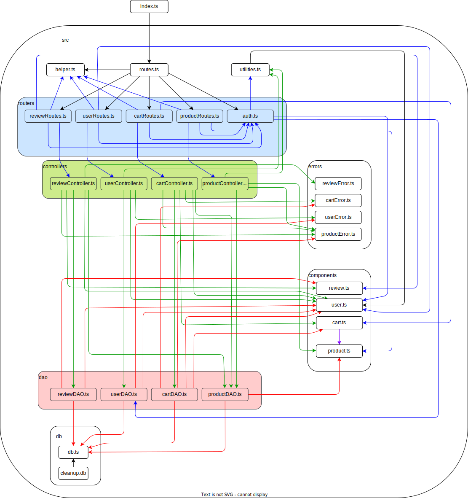

# Test Report

<The goal of this document is to explain how the application was tested, detailing how the test cases were defined and what they cover>

# Contents

-   [Test Report](#test-report)
-   [Contents](#contents)
-   [Dependency graph](#dependency-graph)
-   [Integration approach](#integration-approach)
-   [Tests](#tests)
-   [Coverage](#coverage)
    -   [Coverage of FR](#coverage-of-fr)
    -   [Coverage white box](#coverage-white-box)

# Dependency graph

Here we can see the complete dependency graph of the application. We can see that coupling is not optimal, a refactor could be done to improve the architecture.

# Integration approach

Our integration testing approach involved each team member focusing on their specific component of the system using a bottom-up methodology.

Following the initial phase, where the system's components (users, products, carts, reviews) were divided among team members, the integration process
involved the following steps:

**1. Unit Testing For Each Component :**

**a.User Component**

        a.1.User DAO Testing
        a.2 User Controller Testing
        a.3 User Route Testing

**a.User Component**

        b.1.Product DAO Testing
        b.2 Product Controller Testing
        b.3 Product Route Testing

**c.Review Component**

        c.1.Review DAO Testing
        c.2 Review Controller Testing
        c.3 Review Route Testing

**d.Cart Component**

        d.1.Cart DAO Testing
        d.2 Cart Controller Testing
        d.3 Cart Route Testing

**2. Integeration Testing of the Different Compnent's Functionalities :**

**a.1.User**

    a.1.1. POST /users: Create a new user and handle various scenarios such as incorrect parameters.

    a.1.2 GET /users: Retrieve all users and handle unauthorized access.

    a.1.3 GET /users/roles/:role: Retrieve users by role and handle incorrect role input and unauthorized access.

    a.1.4 GET /users/:username: Retrieve user data by username and handle non-existent user and unauthorized access.

    a.1.5 DELETE /users/:username: Delete a user by username and handle non-existent user and unauthorized access.

    a.1.6. DELETE /users:Delete all users and handle unauthorized access.

    a.1.7. PATCH /users/:username: Update user data, manage non-existent user, validate parameters, and handle unauthorized access.

**a.2.User Authentication**

    a.2.1 POST /sessions: Log in a user and handle incorrect credentials and missing parameters.

    b. DELETE /sessions/current: Log out a user.

    c. GET /sessions/current: Retrieve the current logged-in user and handle unauthorized access.

**b.Producet**

    b.1. POST /products: Create a new product and handle unauthorized access and duplicate product scenarios.

    b.2. PATCH /products/:model:Update product details and handle scenarios such as unauthorized access, non-existent products, invalid date ranges, and validation errors.

    b.3. PATCH /products/:model/sell: Sell a product and handle scenarios such as unauthorized access, non-existent products, empty stock, and invalid quantity.

    b.4. GET /products: Retrieve all products and handle unauthorized access, filter by category or model, and validation errors.

    b.5. GET /products/available: Retrieve all available products and handle unauthorized access, filter by category or model, and validation errors.

    b.6. DELETE /products/:model: Delete a product and handle unauthorized access and non-existent products.

    b.7. DELETE /products:Delete all products and handle unauthorized access.

**c.Review**

    c.1. POST /reviews/:model: Add a new review and handle scenarios such as adding a review for a purchased product, and unauthorized access.

    c.2. GET /reviews/:model: Retrieve reviews for a specific product and handle authorized access and ensure correct retrieval of reviews.

    c.3. DELETE /reviews/:model: Delete a user's review for a product and ensure proper authorization and correct removal of the review.

    c.4. DELETE /reviews/:model/all: Delete all reviews for a product, manage user authorization and ensure all reviews are deleted.

    c.5. DELETE /reviews: Delete all reviews for all products, handling user authorization and ensuring all reviews are removed.

**d.Cart**

    d.1. GET /carts: Retrieve the current cart and handle unauthorized access. Ensure only customers can access this endpoint.

    d.2. POST /carts: Add a product to the cart and handle scenarios such as unauthorized access, product not found, and out of stock conditions.

    d.3. PATCH /carts: Checkout the cart and handle scenarios such as unauthorized access, no current cart, empty cart, and stock validation.

    d.4. GET /carts/history: Retrieve the cart history for the current user and handle unauthorized access.

    d.5. DELETE /carts/current: Clear the current cart and handle unauthorized access.

    d.6. DELETE /carts: Delete all carts and handle unauthorized access, ensuring only admin or manager can perform this action.

    d.7. GET /carts/all: Retrieve all carts and handle unauthorized access, ensuring only admin or manager can access this endpoint.

# Tests

<in the table below list the test cases defined For each test report the object tested, the test level (API, integration, unit) and the technique used to define the test case (BB/ eq partitioning, BB/ boundary, WB/ statement coverage, etc)> <split the table if needed>

|                     Test case name                     | Object(s) tested | Test level |    Technique used     |
| :----------------------------------------------------: | :--------------: | :--------: | :-------------------: |
|               **getIsUserAuthenticated**               |                  |            |                       |
|       should return true for authenticated user        |     UserDAO      | Unit Test  | WB Statement Coverage |
|         should reject with error for db error          |     UserDAO      | Unit Test  | WB Statement Coverage |
|       should return false for incorrect password       |     UserDAO      | Unit Test  | WB Statement Coverage |
|       should return false for non-existent user        |     UserDAO      | Unit Test  | WB Statement Coverage |
|                     **createUser**                     |                  |            |                       |
|                should create a new user                |     UserDAO      | Unit Test  | WB Statement Coverage |
| should throw UserAlreadyExistsError for duplicate user |     UserDAO      | Unit Test  | WB Statement Coverage |
|            should throw error for db error             |     UserDAO      | Unit Test  | WB Statement Coverage |
|                      **getUsers**                      |                  |            |                       |
|                should return all users                 |     UserDAO      | Unit Test  | WB Statement Coverage |
|         should return empty array for no users         |     UserDAO      | Unit Test  | WB Statement Coverage |
|            should throw error for db error             |     UserDAO      | Unit Test  | WB Statement Coverage |
|                   **getUserByRole**                    |                  |            |                       |
|              should return users by role               |     UserDAO      | Unit Test  | WB Statement Coverage |
|         should return empty array for no users         |     UserDAO      | Unit Test  | WB Statement Coverage |
|            should throw error for db error             |     UserDAO      | Unit Test  | WB Statement Coverage |
|                     **deleteUser**                     |                  |            |                       |
|                   should delete user                   |     UserDAO      | Unit Test  | WB Statement Coverage |
|  should throw UserNotFoundError for non-existent user  |     UserDAO      | Unit Test  | WB Statement Coverage |
|            should throw error for db error             |     UserDAO      | Unit Test  | WB Statement Coverage |
|                     **deleteAll**                      |                  |            |                       |
|           should delete all non-admin users            |     UserDAO      | Unit Test  | WB Statement Coverage |
|            should throw error for db error             |     UserDAO      | Unit Test  | WB Statement Coverage |
|                 **getUserByUsername**                  |                  |            |                       |
|             should return user by username             |     UserDAO      | Unit Test  | WB Statement Coverage |
|  should throw UserNotFoundError for non-existent user  |     UserDAO      | Unit Test  | WB Statement Coverage |
|            should throw error for db error             |     UserDAO      | Unit Test  | WB Statement Coverage |
|                 **checkIfUserExists**                  |                  |            |                       |
|           should return true if user exists            |     UserDAO      | Unit Test  | WB Statement Coverage |
|       should return false if user does not exist       |     UserDAO      | Unit Test  | WB Statement Coverage |
|            should throw error for db error             |     UserDAO      | Unit Test  | WB Statement Coverage |
|                   **updateUserInfo**                   |                  |            |                       |
|             should update user information             |     UserDAO      | Unit Test  | WB Statement Coverage |
|  should throw UserNotFoundError for non-existent user  |     UserDAO      | Unit Test  | WB Statement Coverage |
|            should throw error for db error             |     UserDAO      | Unit Test  | WB Statement Coverage |

|                       Test case name                        | Object(s) tested | Test level |    Technique used     |
| :---------------------------------------------------------: | :--------------: | :--------: | :-------------------: |
|                        **addToCart**                        |                  |            |                       |
|         Adds an already existing product to a Cart          |     CartDAO      | Unit Test  | WB Statement Coverage |
|                Adds a new product to a Cart                 |     CartDAO      | Unit Test  | WB Statement Coverage |
| Fails to get join from carts, products_in_cart and products |     CartDAO      | Unit Test  | WB Statement Coverage |
|              Fails to update products_in_cart               |     CartDAO      | Unit Test  | WB Statement Coverage |
|                    Fails to update carts                    |     CartDAO      | Unit Test  | WB Statement Coverage |
|                  Fails to get unpaid cart                   |     CartDAO      | Unit Test  | WB Statement Coverage |
|            Fails to insert into products_in_cart            |     CartDAO      | Unit Test  | WB Statement Coverage |
|           Fails to update carts for new products            |     CartDAO      | Unit Test  | WB Statement Coverage |
|                         **getCart**                         |                  |            |                       |
|                     Gets a user's cart                      |     CartDAO      | Unit Test  | WB Statement Coverage |
|                 Fails to get a user's cart                  |     CartDAO      | Unit Test  | WB Statement Coverage |
|                Fails to get products in cart                |     CartDAO      | Unit Test  | WB Statement Coverage |
|                Error in `getProductsInCart`                 |     CartDAO      | Unit Test  | WB Statement Coverage |
|                    **getProductsInCart**                    |                  |            |                       |
|               Gets a user's products in cart                |     CartDAO      | Unit Test  | WB Statement Coverage |
|        Gets a user's products in cart (one product)         |     CartDAO      | Unit Test  | WB Statement Coverage |
|           Gets a user's products in cart (empty)            |     CartDAO      | Unit Test  | WB Statement Coverage |
|           Fails to get a user's products in cart            |     CartDAO      | Unit Test  | WB Statement Coverage |
|                      **checkoutCart**                       |                  |            |                       |
|                  Checks out a user's cart                   |     CartDAO      | Unit Test  | WB Statement Coverage |
|             Error in selecting the unpaid cart              |     CartDAO      | Unit Test  | WB Statement Coverage |
|                       No unpaid cart                        |     CartDAO      | Unit Test  | WB Statement Coverage |
|                     No products in cart                     |     CartDAO      | Unit Test  | WB Statement Coverage |
|          Error in selecting quantity of a product           |     CartDAO      | Unit Test  | WB Statement Coverage |
|          One of the products has been already sold          |     CartDAO      | Unit Test  | WB Statement Coverage |
|      One of the products has less stock than requested      |     CartDAO      | Unit Test  | WB Statement Coverage |
|             Error in updating products quantity             |     CartDAO      | Unit Test  | WB Statement Coverage |
|                   Error in updating cart                    |     CartDAO      | Unit Test  | WB Statement Coverage |
|                 Error in getProductsInCart                  |     CartDAO      | Unit Test  | WB Statement Coverage |
|                    **getCustomerCarts**                     |                  |            |                       |
|                     Gets a user's carts                     |     CartDAO      | Unit Test  | WB Statement Coverage |
|                 Gets a user's carts (empty)                 |     CartDAO      | Unit Test  | WB Statement Coverage |
|               Gets a user's carts (only one)                |     CartDAO      | Unit Test  | WB Statement Coverage |
|                  Error in selecting carts                   |     CartDAO      | Unit Test  | WB Statement Coverage |
|             Error in selecting products in cart             |     CartDAO      | Unit Test  | WB Statement Coverage |
|                  **removeProductFromCart**                  |                  |            |                       |
|     Removes a product from a user's cart (quantity > 1)     |     CartDAO      | Unit Test  | WB Statement Coverage |
|     Removes a product from a user's cart (quantity = 1)     |     CartDAO      | Unit Test  | WB Statement Coverage |
|           Error in select quantity and/or cartsId           |     CartDAO      | Unit Test  | WB Statement Coverage |
|     Fails to remove product from cart, no product found     |     CartDAO      | Unit Test  | WB Statement Coverage |
|          Error in updating quantity (quantity > 1)          |     CartDAO      | Unit Test  | WB Statement Coverage |
|   Error in deleting from products_in_cart (quantity = 1)    |     CartDAO      | Unit Test  | WB Statement Coverage |
|                   Error in updating carts                   |     CartDAO      | Unit Test  | WB Statement Coverage |
|                        **clearCart**                        |                  |            |                       |
|                    Clears a user's cart                     |     CartDAO      | Unit Test  | WB Statement Coverage |
|                       Cart not found                        |     CartDAO      | Unit Test  | WB Statement Coverage |
|                   Error in selecting cart                   |     CartDAO      | Unit Test  | WB Statement Coverage |
|           Error in deleting from products_in_car            |     CartDAO      | Unit Test  | WB Statement Coverage |
|                   Error in updating cart                    |     CartDAO      | Unit Test  | WB Statement Coverage |
|                     **deleteAllCarts**                      |                  |            |                       |
|                      Deletes all carts                      |     CartDAO      | Unit Test  | WB Statement Coverage |
|                  Fails to delete all carts                  |     CartDAO      | Unit Test  | WB Statement Coverage |
|                       **getAllCarts**                       |                  |            |                       |
|                       Gets all carts                        |     CartDAO      | Unit Test  | WB Statement Coverage |
|                   Gets all carts (empty)                    |     CartDAO      | Unit Test  | WB Statement Coverage |
|                  Gets all carts (only one)                  |     CartDAO      | Unit Test  | WB Statement Coverage |
|                 Error in getProductsInCart                  |     CartDAO      | Unit Test  | WB Statement Coverage |
|                 Error in selecting all cart                 |     CartDAO      | Unit Test  | WB Statement Coverage |
|                       **createCart**                        |                  |            |                       |
|                       Creates a cart                        |     CartDAO      | Unit Test  | WB Statement Coverage |
|                   Fails to create a cart                    |     CartDAO      | Unit Test  | WB Statement Coverage |

|                          Test case name                           | Object(s) tested | Test level |    Technique used     |
| :---------------------------------------------------------------: | :--------------: | :--------: | :-------------------: |
|                       **registerProducts**                        |                  |            |                       |
|                        Registers a product                        |    ProcutDAO     | Unit Test  | WB Statement Coverage |
|              Register a product without arrival date              |    ProcutDAO     | Unit Test  | WB Statement Coverage |
|                Register a product without details                 |    ProcutDAO     | Unit Test  | WB Statement Coverage |
|     Register a product without arrival date but with details      |    ProcutDAO     | Unit Test  | WB Statement Coverage |
|      Register a product with details but without arrivalDate      |    ProcutDAO     | Unit Test  | WB Statement Coverage |
|        Register a product without details and arrivalDate         |    ProcutDAO     | Unit Test  | WB Statement Coverage |
|                    Fails to register a product                    |    ProcutDAO     | Unit Test  | WB Statement Coverage |
|                       **getProductByModel**                       |                  |            |                       |
|                      Gets a product by model                      |    ProcutDAO     | Unit Test  | WB Statement Coverage |
|              Returns null when product is not found               |    ProcutDAO     | Unit Test  | WB Statement Coverage |
|                  Fails to get a product by model                  |    ProcutDAO     | Unit Test  | WB Statement Coverage |
|                     **changeProductQuantity**                     |                  |            |                       |
|                 Changes the quantity of a product                 |    ProcutDAO     | Unit Test  | WB Statement Coverage |
|       Changes the quantity of a product without change date       |    ProcutDAO     | Unit Test  | WB Statement Coverage |
|             Fails to change the quantity of a product             |    ProcutDAO     | Unit Test  | WB Statement Coverage |
|                          **sellProduct**                          |                  |            |                       |
|                          Sells a product                          |    ProcutDAO     | Unit Test  | WB Statement Coverage |
|               Sells a product without selling date                |    ProcutDAO     | Unit Test  | WB Statement Coverage |
|                      Fails to sell a product                      |    ProcutDAO     | Unit Test  | WB Statement Coverage |
|                     **getProductsByCategory**                     |                  |            |                       |
|              Gets all products of a certain category              |    ProcutDAO     | Unit Test  | WB Statement Coverage |
|      Gets an array of a single product of a certain category      |    ProcutDAO     | Unit Test  | WB Statement Coverage |
|         Returns an empty array when no products are found         |    ProcutDAO     | Unit Test  | WB Statement Coverage |
|                 Fails to get products by category                 |    ProcutDAO     | Unit Test  | WB Statement Coverage |
|                      **getProductsByModel**                       |                  |            |                       |
|               Gets all products of a certain model                |    ProcutDAO     | Unit Test  | WB Statement Coverage |
|       Gets an array of a single product of a certain model        |    ProcutDAO     | Unit Test  | WB Statement Coverage |
|         Returns an empty array when no products are found         |    ProcutDAO     | Unit Test  | WB Statement Coverage |
|                  Fails to get products by model                   |    ProcutDAO     | Unit Test  | WB Statement Coverage |
|                        **getAllProducts**                         |                  |            |                       |
|                         Gets all products                         |    ProcutDAO     | Unit Test  | WB Statement Coverage |
|                 Gets an array of a single product                 |    ProcutDAO     | Unit Test  | WB Statement Coverage |
|         Returns an empty array when no products are found         |    ProcutDAO     | Unit Test  | WB Statement Coverage |
|                     Fails to get all products                     |    ProcutDAO     | Unit Test  | WB Statement Coverage |
|                **getAvailableProductsByCategory**                 |                  |            |                       |
|         Gets all available products of a certain category         |    ProcutDAO     | Unit Test  | WB Statement Coverage |
| Gets an array of a single available product of a certain category |    ProcutDAO     | Unit Test  | WB Statement Coverage |
|    Returns an empty array when no available products are found    |    ProcutDAO     | Unit Test  | WB Statement Coverage |
|            Fails to get available products by category            |    ProcutDAO     | Unit Test  | WB Statement Coverage |
|                  **getAvailableProductsByModel**                  |                  |            |                       |
|          Gets all available products of a certain model           |    ProcutDAO     | Unit Test  | WB Statement Coverage |
|  Gets an array of a single available product of a certain model   |    ProcutDAO     | Unit Test  | WB Statement Coverage |
|    Returns an empty array when no available products are found    |    ProcutDAO     | Unit Test  | WB Statement Coverage |
|             Fails to get available products by model              |    ProcutDAO     | Unit Test  | WB Statement Coverage |
|                    **getAllAvailableProducts**                    |                  |            |                       |
|                    Gets all available products                    |    ProcutDAO     | Unit Test  | WB Statement Coverage |
|            Gets an array of a single available product            |    ProcutDAO     | Unit Test  | WB Statement Coverage |
|    Returns an empty array when no available products are found    |    ProcutDAO     | Unit Test  | WB Statement Coverage |
|                Fails to get all available product                 |    ProcutDAO     | Unit Test  | WB Statement Coverage |
|                       **deleteAllProducts**                       |                  |            |                       |
|              Deletes all products from the database               |    ProcutDAO     | Unit Test  | WB Statement Coverage |
|          Fails to delete all products from the database           |    ProcutDAO     | Unit Test  | WB Statement Coverage |
|                         **deleteProduct**                         |                  |            |                       |
|                Deletes a product from the database                |    ProcutDAO     | Unit Test  | WB Statement Coverage |
|            Fails to delete a product from the database            |    ProcutDAO     | Unit Test  | WB Statement Coverage |

|                            Test case name                             | Object(s) tested | Test level |    Technique used     |
| :-------------------------------------------------------------------: | :--------------: | :--------: | :-------------------: |
|                             **addReview**                             |                  |            |                       |
|                             Add a review                              |    ReviewDAO     | Unit Test  | WB Statement Coverage |
|                         Fails to add a review                         |    ReviewDAO     | Unit Test  | WB Statement Coverage |
|                         **checkExistsReview**                         |                  |            |                       |
|      Check for an existing review for a specif product and user       |    ReviewDAO     | Unit Test  | WB Statement Coverage |
|                Returns false when review is not found                 |    ReviewDAO     | Unit Test  | WB Statement Coverage |
| Fails to check for an existing review for a specific product and user |    ReviewDAO     | Unit Test  | WB Statement Coverage |
|                         **getProductReviews**                         |                  |            |                       |
|               Gets all the review for a specific model                |    ReviewDAO     | Unit Test  | WB Statement Coverage |
|             Returns empty array when review is not found              |    ReviewDAO     | Unit Test  | WB Statement Coverage |
|                    Fails to get a review by model                     |    ReviewDAO     | Unit Test  | WB Statement Coverage |
|                           **deleteReview**                            |                  |            |                       |
|                  Deletes a review from the database                   |    ReviewDAO     | Unit Test  | WB Statement Coverage |
|              Fails to delete a review from the database               |    ReviewDAO     | Unit Test  | WB Statement Coverage |
|                      **deleteReviewsOfProduct**                       |                  |            |                       |
|               Deletes all reviews of a specific product               |    ReviewDAO     | Unit Test  | WB Statement Coverage |
|             Fails to delete reviews of a specific product             |    ReviewDAO     | Unit Test  | WB Statement Coverage |
|                         **deleteAllReviews**                          |                  |            |                       |
|                 Deletes all reviews from the database                 |    ReviewDAO     | Unit Test  | WB Statement Coverage |
|             Fails to delete all reviews from the database             |    ReviewDAO     | Unit Test  | WB Statement Coverage |

|                                Test case name                                 | Object(s) tested | Test level |    Technique used     |
| :---------------------------------------------------------------------------: | :--------------: | :--------: | :-------------------: |
|                             **registerProducts**                              |                  |            |                       |
|                     Insert a valid product in the system                      |  userController  | Unit Test  | WB Statement Coverage |
|              Insert a product that already exists in the system               |  userController  | Unit Test  | WB Statement Coverage |
|              Insert a product with an arrival date in the future              |  userController  | Unit Test  | WB Statement Coverage |
|                           **changeProductQuantity**                           |                  |            |                       |
|                      Increase the quantity of a product                       |  userController  | Unit Test  | WB Statement Coverage |
|            Increase the quantity of a product that does not exist             |  userController  | Unit Test  | WB Statement Coverage |
|      Increase the quantity of a product with a change date in the future      |  userController  | Unit Test  | WB Statement Coverage |
| Increase the quantity of a product with a change date before the arrival date |  userController  | Unit Test  | WB Statement Coverage |
|                                **sellProduct**                                |                  |            |                       |
|                    Sell a product (decrease the quantity)                     |  userController  | Unit Test  | WB Statement Coverage |
|            Decrease the quantity of a product that does not exist             |  userController  | Unit Test  | WB Statement Coverage |
|               Sell a product with a selling date in the future                |  userController  | Unit Test  | WB Statement Coverage |
|          Sell a product with a selling date before the arrival date           |  userController  | Unit Test  | WB Statement Coverage |
|                    Sell a product that is already sold out                    |  userController  | Unit Test  | WB Statement Coverage |
|                  Sell more units than the available quantity                  |  userController  | Unit Test  | WB Statement Coverage |
|                                **getProducts**                                |                  |            |                       |
|            Get all products with only one product in the database             |  userController  | Unit Test  | WB Statement Coverage |
|            Get all products with multiple products in the database            |  userController  | Unit Test  | WB Statement Coverage |
|          Get all products in the database even if some are sold out           |  userController  | Unit Test  | WB Statement Coverage |
|               Get all products with no products in the database               |  userController  | Unit Test  | WB Statement Coverage |
|                    Get all products with a category filter                    |  userController  | Unit Test  | WB Statement Coverage |
|                     Get all products with a model filter                      |  userController  | Unit Test  | WB Statement Coverage |
|       Try to get all products by category without specifying a category       |  userController  | Unit Test  | WB Statement Coverage |
|          Try to get all products by category with a model specified           |  userController  | Unit Test  | WB Statement Coverage |
|          Try to get all products by model without specifying a model          |  userController  | Unit Test  | WB Statement Coverage |
|            Try to get all products by model with a category filter            |  userController  | Unit Test  | WB Statement Coverage |
|          Try to get all products by model with a non-existing model           |  userController  | Unit Test  | WB Statement Coverage |
|         Get all products without grouping but with a category filter          |  userController  | Unit Test  | WB Statement Coverage |
|           Get all products without grouping but with a model filter           |  userController  | Unit Test  | WB Statement Coverage |
|                           **getAvailableProducts**                            |                  |            |                       |
|       Get all available products with only one product in the database        |  userController  | Unit Test  | WB Statement Coverage |
|       Get all available products with multiple products in the database       |  userController  | Unit Test  | WB Statement Coverage |
|          Get all available products with no products in the database          |  userController  | Unit Test  | WB Statement Coverage |
|               Get all available products with a category filter               |  userController  | Unit Test  | WB Statement Coverage |
|                Get all available products with a model filter                 |  userController  | Unit Test  | WB Statement Coverage |
|  Try to get all available products by category without specifying a category  |  userController  | Unit Test  | WB Statement Coverage |
|     Try to get all available products by model without specifying a model     |  userController  | Unit Test  | WB Statement Coverage |
|     Try to get all available products by model with a non-existing model      |  userController  | Unit Test  | WB Statement Coverage |
|    Get all available products without grouping but with a category filter     |  userController  | Unit Test  | WB Statement Coverage |
|      Get all available products without grouping but with a model filter      |  userController  | Unit Test  | WB Statement Coverage |
|                             **deleteAllProducts**                             |                  |            |                       |
|                      Delete all products in the database                      |  userController  | Unit Test  | WB Statement Coverage |
|                               **deleteProduct**                               |                  |            |                       |
|                       Delete a product in the database                        |  userController  | Unit Test  | WB Statement Coverage |
|                  Try to delete a product that does not exist                  |  userController  | Unit Test  | WB Statement Coverage |

|                         Test case name                         | Object(s) tested | Test level |    Technique used     |
| :------------------------------------------------------------: | :--------------: | :--------: | :-------------------: |
|                         **addToCart**                          |                  |            |                       |
|                Add a valid product to the cart                 |  cartController  | Unit Test  | WB Statement Coverage |
|     Returns an empty cart if the user does not have a cart     |  cartController  | Unit Test  | WB Statement Coverage |
|   Fails in adding a product that does not exist to the cart    |  cartController  | Unit Test  | WB Statement Coverage |
|   Fails in adding a product to the cart that is out of stock   |  cartController  | Unit Test  | WB Statement Coverage |
|                          **getCart**                           |                  |            |                       |
|                Get all items in the user's cart                |  cartController  | Unit Test  | WB Statement Coverage |
|          Get cart items for a user with an empty cart          |  cartController  | Unit Test  | WB Statement Coverage |
|                        **checkoutCart**                        |                  |            |                       |
|                       Checkout the cart                        |  cartController  | Unit Test  | WB Statement Coverage |
|           No information about an unpaid cart exists           |  cartController  | Unit Test  | WB Statement Coverage |
|                     Checkout an empty cart                     |  cartController  | Unit Test  | WB Statement Coverage |
|     At least one of the products in the cart is not found      |  cartController  | Unit Test  | WB Statement Coverage |
|    At least one of the products in the cart is out of stock    |  cartController  | Unit Test  | WB Statement Coverage |
|    At least one of the products in the cart is low on stock    |  cartController  | Unit Test  | WB Statement Coverage |
|                      **getCustomerCarts**                      |                  |            |                       |
|                  Get all carts for a customer                  |  cartController  | Unit Test  | WB Statement Coverage |
|             Get carts for a customer with no carts             |  cartController  | Unit Test  | WB Statement Coverage |
|                   **removeProductFromCart**                    |                  |            |                       |
|                 Remove a product from the cart                 |  cartController  | Unit Test  | WB Statement Coverage |
|       Remove a product from the cart that does not exist       |  cartController  | Unit Test  | WB Statement Coverage |
|     Remove a product from the cart that is not in the cart     |  cartController  | Unit Test  | WB Statement Coverage |
| Tries to remove a product from cart but no unpaid cart exists  |  cartController  | Unit Test  | WB Statement Coverage |
|   Tries to remove a product from cart but the cart is empty    |  cartController  | Unit Test  | WB Statement Coverage |
|                         **clearCart**                          |                  |            |                       |
|              Clear all items from the user's cart              |  cartController  | Unit Test  | WB Statement Coverage |
| Clear all items from the user's cart but no unpaid cart exists |  cartController  | Unit Test  | WB Statement Coverage |
|                       **deleteAllCarts**                       |                  |            |                       |
|               Delete all carts from the database               |  cartController  | Unit Test  | WB Statement Coverage |
|                        **getAllCarts**                         |                  |            |                       |
|                Get all carts from the database                 |  cartController  | Unit Test  | WB Statement Coverage |
|         Get all carts from the database but none exist         |  cartController  | Unit Test  | WB Statement Coverage |

|                          Test case name                           | Object(s) tested  | Test level |    Technique used     |
| :---------------------------------------------------------------: | :---------------: | :--------: | :-------------------: |
|                       **registerProducts**                        |                   |            |                       |
|                        Register a product                         | productController | Unit Test  | WB Statement Coverage |
|             RRegister a product without arrival date              | productController | Unit Test  | WB Statement Coverage |
|                Register a product without details                 | productController | Unit Test  | WB Statement Coverage |
|     Register a product without arrival date but with details      | productController | Unit Test  | WB Statement Coverage |
|      Register a product with details but without arrivalDate      | productController | Unit Test  | WB Statement Coverage |
|        Register a product without details and arrivalDate         | productController | Unit Test  | WB Statement Coverage |
|                    Fails to register a product                    | productController | Unit Test  | WB Statement Coverage |
|                       **getProductByModel**                       |                   |            |                       |
|                      Gets a product by model                      | productController | Unit Test  | WB Statement Coverage |
|              Returns null when product is not found               | productController | Unit Test  | WB Statement Coverage |
|                  Fails to get a product by model                  | productController | Unit Test  | WB Statement Coverage |
|                     **changeProductQuantity**                     |                   |            |                       |
|                 Changes the quantity of a product                 | productController | Unit Test  | WB Statement Coverage |
|       Changes the quantity of a product without change date       | productController | Unit Test  | WB Statement Coverage |
|             Fails to change the quantity of a product             | productController | Unit Test  | WB Statement Coverage |
|                          **sellProduct**                          |                   |            |                       |
|                          Sells a product                          | productController | Unit Test  | WB Statement Coverage |
|               Sells a product without selling date                | productController | Unit Test  | WB Statement Coverage |
|                      Fails to sell a product                      | productController | Unit Test  | WB Statement Coverage |
|                     **getProductsByCategory**                     |                   |            |                       |
|              Gets all products of a certain category              | productController | Unit Test  | WB Statement Coverage |
|      Gets an array of a single product of a certain category      | productController | Unit Test  | WB Statement Coverage |
|         Returns an empty array when no products are found         | productController | Unit Test  | WB Statement Coverage |
|                 Fails to get products by category                 | productController | Unit Test  | WB Statement Coverage |
|                      **getProductsByModel**                       |                   |            |                       |
|               Gets all products of a certain model                | productController | Unit Test  | WB Statement Coverage |
|       Gets an array of a single product of a certain model        | productController | Unit Test  | WB Statement Coverage |
|         Returns an empty array when no products are found         | productController | Unit Test  | WB Statement Coverage |
|                  Fails to get products by model                   | productController | Unit Test  | WB Statement Coverage |
|                        **getAllProducts**                         |                   |            |                       |
|                         Gets all products                         | productController | Unit Test  | WB Statement Coverage |
|                 Gets an array of a single product                 | productController | Unit Test  | WB Statement Coverage |
|         Returns an empty array when no products are found         | productController | Unit Test  | WB Statement Coverage |
|                     Fails to get all products                     | productController | Unit Test  | WB Statement Coverage |
|                **getAvailableProductsByCategory**                 |                   |            |                       |
|         Gets all available products of a certain category         | productController | Unit Test  | WB Statement Coverage |
| Gets an array of a single available product of a certain category | productController | Unit Test  | WB Statement Coverage |
|    Returns an empty array when no available products are found    | productController | Unit Test  | WB Statement Coverage |
|            Fails to get available products by category            | productController | Unit Test  | WB Statement Coverage |
|                  **getAvailableProductsByModel**                  |                   |            |                       |
|          Gets all available products of a certain model           | productController | Unit Test  | WB Statement Coverage |
|  Gets an array of a single available product of a certain model   | productController | Unit Test  | WB Statement Coverage |
|    Returns an empty array when no available products are found    | productController | Unit Test  | WB Statement Coverage |
|             Fails to get available products by model              | productController | Unit Test  | WB Statement Coverage |
|                    **getAllAvailableProducts**                    |                   |            |                       |
|                    Gets all available products                    | productController | Unit Test  | WB Statement Coverage |
|            Gets an array of a single available product            | productController | Unit Test  | WB Statement Coverage |
|    Returns an empty array when no available products are found    | productController | Unit Test  | WB Statement Coverage |
|                Fails to get all available products                | productController | Unit Test  | WB Statement Coverage |
|                       **deleteAllProducts**                       |                   |            |                       |
|              Deletes all products from the database               | productController | Unit Test  | WB Statement Coverage |
|          Fails to delete all products from the database           | productController | Unit Test  | WB Statement Coverage |
|                         **deleteProduct**                         |                   |            |                       |
|                Deletes a product from the database                | productController | Unit Test  | WB Statement Coverage |
|            Fails to delete a product from the database            | productController | Unit Test  | WB Statement Coverage |

|                                   Test case name                                    | Object(s) tested | Test level |    Technique used     |
| :---------------------------------------------------------------------------------: | :--------------: | :--------: | :-------------------: |
|                                    **addReview**                                    |                  |            |                       |
|                                 should add a review                                 | reviewController | Unit Test  | WB Statement Coverage |
|  should throw ProductNotFoundError when adding a review for a non-existing product  | reviewController | Unit Test  | WB Statement Coverage |
|      should throw ExistingReviewError when adding a review that already exists      | reviewController | Unit Test  | WB Statement Coverage |
|                                **getProductReviews**                                |                  |            |                       |
|                                should return reviews                                | reviewController | Unit Test  | WB Statement Coverage |
|                                  **deleteReview**                                   |                  |            |                       |
|                               should delete a review                                | reviewController | Unit Test  | WB Statement Coverage |
| should throw ProductNotFoundError when deleting a review for a non-existing product | reviewController | Unit Test  | WB Statement Coverage |
|    should throw NoReviewProductError when deleting a review that does not exist     | reviewController | Unit Test  | WB Statement Coverage |
|                             **deleteReviewsOfProduct**                              |                  |            |                       |
|                       should delete all reviews of a product                        | reviewController | Unit Test  | WB Statement Coverage |
|  should throw ProductNotFoundError when deleting reviews of a non-existing product  | reviewController | Unit Test  | WB Statement Coverage |
|                                **deleteAllReviews**                                 |                  |            |                       |
|                              should delete all reviews                              | reviewController | Unit Test  | WB Statement Coverage |

|                                       Test case name                                        | Object(s) tested | Test level |    Technique used     |
| :-----------------------------------------------------------------------------------------: | :--------------: | :--------: | :-------------------: |
|                               **POST /ezelectronics/users/**                                |                  |            |                       |
|                                  Returns 200 if successful                                  |    User APIs     |  API Test  | WB Statement Coverage |
|                               Returns 503 if an error occurs                                |    User APIs     |  API Test  | WB Statement Coverage |
|                             Returns 409 if user already exists                              |    User APIs     |  API Test  | WB Statement Coverage |
|                             Returns 422 if username is missing                              |    User APIs     |  API Test  | WB Statement Coverage |
|                               Returns 422 if name is missing                                |    User APIs     |  API Test  | WB Statement Coverage |
|                              Returns 422 if surname is missing                              |    User APIs     |  API Test  | WB Statement Coverage |
|                             Returns 422 if password is missing                              |    User APIs     |  API Test  | WB Statement Coverage |
|                               Returns 422 if role is missing                                |    User APIs     |  API Test  | WB Statement Coverage |
|                               Returns 422 if role is invalid                                |    User APIs     |  API Test  | WB Statement Coverage |
|                                **GET /ezelectronics/users/**                                |                  |            |                       |
|                                  Returns 200 if successful                                  |    User APIs     |  API Test  | WB Statement Coverage |
|                               Returns 503 if an error occurs                                |    User APIs     |  API Test  | WB Statement Coverage |
|                             Returns 401 if user is not an admin                             |    User APIs     |  API Test  | WB Statement Coverage |
|                          **GET /ezelectronics/users/roles/:role**                           |                  |            |                       |
|                                  Returns 200 if successful                                  |    User APIs     |  API Test  | WB Statement Coverage |
|                               Returns 422 if role is invalid                                |    User APIs     |  API Test  | WB Statement Coverage |
|                               Returns 503 if an error occurs                                |    User APIs     |  API Test  | WB Statement Coverage |
|                             Returns 401 if user is not an admin                             |    User APIs     |  API Test  | WB Statement Coverage |
|                           **GET /ezelectronics/users/:username**                            |                  |            |                       |
|                 Returns 200 if successful, customer calling on its username                 |    User APIs     |  API Test  | WB Statement Coverage |
|                               Returns 503 if an error occurs                                |    User APIs     |  API Test  | WB Statement Coverage |
|      Returns 200 if user is an admin and tries to retrieve another user's information       |    User APIs     |  API Test  | WB Statement Coverage |
|    Returns 401 if user is not an admin and tries to retrieve another user's information     |    User APIs     |  API Test  | WB Statement Coverage |
| Returns 401 if the calling user is an Admin an `username` represents a different Admin user |    User APIs     |  API Test  | WB Statement Coverage |
|                             Returns 404 if user does not exist                              |    User APIs     |  API Test  | WB Statement Coverage |
|                          **DELETE /ezelectronics/users/:username**                          |                  |            |                       |
|                                  Returns 200 if successful                                  |    User APIs     |  API Test  | WB Statement Coverage |
|                               Returns 503 if an error occurs                                |    User APIs     |  API Test  | WB Statement Coverage |
|                             Returns 401 if user is not an admin                             |    User APIs     |  API Test  | WB Statement Coverage |
|                              **DELETE /ezelectronics/users/**                               |                  |            |                       |
|                                  Returns 200 if successful                                  |    User APIs     |  API Test  | WB Statement Coverage |
|                               Returns 503 if an error occurs                                |    User APIs     |  API Test  | WB Statement Coverage |
|                             Returns 401 if user is not an admin                             |    User APIs     |  API Test  | WB Statement Coverage |
|                          **PATCH /ezelectronics/users/:username**                           |                  |            |                       |
|                                  Returns 200 if successful                                  |    User APIs     |  API Test  | WB Statement Coverage |
|                               Returns 503 if an error occurs                                |    User APIs     |  API Test  | WB Statement Coverage |
|            Returns 200 if successful, admin updating another user's information             |    User APIs     |  API Test  | WB Statement Coverage |
|                             Returns 404 if user does not exist                              |    User APIs     |  API Test  | WB Statement Coverage |
|             Returns 401 if username does not correspond to the user's username              |    User APIs     |  API Test  | WB Statement Coverage |
|                     Returns 400 if birthdate is after the current date                      |    User APIs     |  API Test  | WB Statement Coverage |
| Returns 401 if username does not correspond to the user's username and the user is an admin |    User APIs     |  API Test  | WB Statement Coverage |
|                              **POST /ezelectronics/sessions**                               |                  |            |                       |
|                                  Returns 200 if successful                                  |    Auth APIs     |  API Test  | WB Statement Coverage |
|                           Returns 401 if username does not exist                            |    Auth APIs     |  API Test  | WB Statement Coverage |
|                            Returns 401 if password is incorrect                             |    Auth APIs     |  API Test  | WB Statement Coverage |
|                         **DELETE /ezelectronics/sessions/current**                          |                  |            |                       |
|                              Returns 200 if successful, logout                              |    Auth APIs     |  API Test  | WB Statement Coverage |
|                               Returns 503 if an error occurs                                |    Auth APIs     |  API Test  | WB Statement Coverage |
|                            Returns 401 if user is not logged in                             |    Auth APIs     |  API Test  | WB Statement Coverage |
|                           **GET /ezelectronics/sessions/current**                           |                  |            |                       |
|                                  Returns 200 if successful                                  |    Auth APIs     |  API Test  | WB Statement Coverage |
|                            Returns 401 if user is not logged in                             |    Auth APIs     |  API Test  | WB Statement Coverage |

|                                            Test case name                                            | Object(s) tested | Test level |    Technique used     |
| :--------------------------------------------------------------------------------------------------: | :--------------: | :--------: | :-------------------: |
|                                    **GET /ezelectronics/carts/**                                     |                  |            |                       |
|                                      Returns 200 if successful                                       |    Cart APIs     |  API Test  | WB Statement Coverage |
|                                    Returns 503 if an error occurs                                    |    Cart APIs     |  API Test  | WB Statement Coverage |
|                                Returns 401 if user is not a customer                                 |    Cart APIs     |  API Test  | WB Statement Coverage |
|                                    **POST /ezelectronics/carts/**                                    |                  |            |                       |
|                                      Returns 200 if successful                                       |    Cart APIs     |  API Test  | WB Statement Coverage |
|                                Returns 401 if user is not a customer                                 |    Cart APIs     |  API Test  | WB Statement Coverage |
|                                Returns 404 if product does not exist                                 |    Cart APIs     |  API Test  | WB Statement Coverage |
|                                Returns 409 if product is out of stock                                |    Cart APIs     |  API Test  | WB Statement Coverage |
|                                    Returns 422 if model is empty                                     |    Cart APIs     |  API Test  | WB Statement Coverage |
|                                   **PATCH /ezelectronics/carts/**                                    |                  |            |                       |
|                                      Returns 200 if successful                                       |    Cart APIs     |  API Test  | WB Statement Coverage |
|                                Returns 401 if user is not a customer                                 |    Cart APIs     |  API Test  | WB Statement Coverage |
|                     Returns 404 if there is no information about an unpaid cart                      |    Cart APIs     |  API Test  | WB Statement Coverage |
|                  Returns 400 if there is an unpaid cart but it contains no products                  |    Cart APIs     |  API Test  | WB Statement Coverage |
|            Returns 409 if there is at least one product in the cart that is out of stock             |    Cart APIs     |  API Test  | WB Statement Coverage |
|    Returns 409 if at least one product in the cart has a quantity higher than the available stock    |    Cart APIs     |  API Test  | WB Statement Coverage |
|                                 **GET /ezelectronics/carts/history**                                 |                  |            |                       |
|                                      Returns 200 if successful                                       |    Cart APIs     |  API Test  | WB Statement Coverage |
|                                    Returns 503 if an error occurs                                    |    Cart APIs     |  API Test  | WB Statement Coverage |
|                                Returns 401 if user is not a customer                                 |    Cart APIs     |  API Test  | WB Statement Coverage |
|                           **DELETE /ezelectronics/carts/products/:model**                            |                  |            |                       |
|                                      Returns 200 if successful                                       |    Cart APIs     |  API Test  | WB Statement Coverage |
|                                Returns 401 if user is not a customer                                 |    Cart APIs     |  API Test  | WB Statement Coverage |
|                                    Returns 404 if model is empty                                     |    Cart APIs     |  API Test  | WB Statement Coverage |
|                                Returns 404 if product does not exist                                 |    Cart APIs     |  API Test  | WB Statement Coverage |
| Returns 404 if there is no information about an unpaid cart, or if there are no products in the cart |    Cart APIs     |  API Test  | WB Statement Coverage |
|                            Returns 404 if the product is not in the cart                             |    Cart APIs     |  API Test  | WB Statement Coverage |
|                               **DELETE /ezelectronics/carts/current**                                |                  |            |                       |
|                                      Returns 200 if successful                                       |    Cart APIs     |  API Test  | WB Statement Coverage |
|                                Returns 401 if user is not a customer                                 |    Cart APIs     |  API Test  | WB Statement Coverage |
|                     Returns 404 if there is no information about an unpaid cart                      |    Cart APIs     |  API Test  | WB Statement Coverage |
|                                   **DELETE /ezelectronics/carts/**                                   |                  |            |                       |
|                                      Returns 200 if successful                                       |    Cart APIs     |  API Test  | WB Statement Coverage |
|                            Returns 401 if user is not an admin or manager                            |    Cart APIs     |  API Test  | WB Statement Coverage |
|                                    Returns 503 if an error occurs                                    |    Cart APIs     |  API Test  | WB Statement Coverage |
|                                   **GET /ezelectronics/carts/all**                                   |                  |            |                       |
|                                      Returns 200 if successful                                       |    Cart APIs     |  API Test  | WB Statement Coverage |
|                            Returns 401 if user is not an admin or manager                            |    Cart APIs     |  API Test  | WB Statement Coverage |
|                                    Returns 503 if an error occurs                                    |    Cart APIs     |  API Test  | WB Statement Coverage |

|                                   Test case name                                    | Object(s) tested | Test level |    Technique used     |
| :---------------------------------------------------------------------------------: | :--------------: | :--------: | :-------------------: |
|                          **POST /ezelectronics/products/**                          |                  |            |                       |
|                              Returns 200 if successful                              |   Product APIs   |  API Test  | WB Statement Coverage |
|                        Returns 422 if model is not a string                         |   Product APIs   |  API Test  | WB Statement Coverage |
|                            Returns 422 if model is empty                            |   Product APIs   |  API Test  | WB Statement Coverage |
|                       Returns 422 if category is not a string                       |   Product APIs   |  API Test  | WB Statement Coverage |
|                          Returns 422 if category is empty                           |   Product APIs   |  API Test  | WB Statement Coverage |
|               Returns 422 if category is not one of the allowed types               |   Product APIs   |  API Test  | WB Statement Coverage |
|                       Returns 422 if quantity is not a number                       |   Product APIs   |  API Test  | WB Statement Coverage |
|                          Returns 422 if quantity is empty                           |   Product APIs   |  API Test  | WB Statement Coverage |
|                       Returns 422 if details is not a string                        |   Product APIs   |  API Test  | WB Statement Coverage |
|                     Returns 422 if sellingPrice is not a number                     |   Product APIs   |  API Test  | WB Statement Coverage |
|                        Returns 422 if sellingPrice is empty                         |   Product APIs   |  API Test  | WB Statement Coverage |
|                     Returns 422 if arrivalDate is not a string                      |   Product APIs   |  API Test  | WB Statement Coverage |
|                   Returns 401 if user is not an admin or manager                    |   Product APIs   |  API Test  | WB Statement Coverage |
| Returns 409 if model represents an already existing set of products in the database |   Product APIs   |  API Test  | WB Statement Coverage |
|                     Returns 400 if arrivalDate is in the future                     |   Product APIs   |  API Test  | WB Statement Coverage |
|                      **PATCH /ezelectronics/products/:model**                       |                  |            |                       |
|                              Returns 200 if successful                              |   Product APIs   |  API Test  | WB Statement Coverage |
|                   Returns 401 if user is not an admin or manager                    |   Product APIs   |  API Test  | WB Statement Coverage |
|                    Returns 404 (cannot patch) if model is empty                     |   Product APIs   |  API Test  | WB Statement Coverage |
|                       Returns 422 if quantity is not a number                       |   Product APIs   |  API Test  | WB Statement Coverage |
|                          Returns 422 if quantity is empty                           |   Product APIs   |  API Test  | WB Statement Coverage |
|                      Returns 422 if changeDate is not a string                      |   Product APIs   |  API Test  | WB Statement Coverage |
|             Returns 404 if model does not represent an existing product             |   Product APIs   |  API Test  | WB Statement Coverage |
|                     Returns 400 if changeDate is in the future                      |   Product APIs   |  API Test  | WB Statement Coverage |
|                   Returns 400 if changeDate is before arrivalDate                   |   Product APIs   |  API Test  | WB Statement Coverage |
|                    **PATCH /ezelectronics/products/:model/sell**                    |                  |            |                       |
|                              Returns 200 if successful                              |   Product APIs   |  API Test  | WB Statement Coverage |
|                   Returns 401 if user is not an admin or manager                    |   Product APIs   |  API Test  | WB Statement Coverage |
|                       Returns 422 if quantity is not a number                       |   Product APIs   |  API Test  | WB Statement Coverage |
|                          Returns 422 if quantity is empty                           |   Product APIs   |  API Test  | WB Statement Coverage |
|                     Returns 422 if sellingDate is not a string                      |   Product APIs   |  API Test  | WB Statement Coverage |
|             Returns 404 if model does not represent an existing product             |   Product APIs   |  API Test  | WB Statement Coverage |
|                     Returns 400 if sellingDate is in the future                     |   Product APIs   |  API Test  | WB Statement Coverage |
|                  Returns 400 if sellingDate is before arrivalDate                   |   Product APIs   |  API Test  | WB Statement Coverage |
|                     Returns 409 if the available quantity is 0                      |   Product APIs   |  API Test  | WB Statement Coverage |
|    Returns 409 if the requested quantity is greater than the available quantity     |   Product APIs   |  API Test  | WB Statement Coverage |
|                          **GET /ezelectronics/products/**                           |                  |            |                       |
|                              Returns 200 if successful                              |   Product APIs   |  API Test  | WB Statement Coverage |
|                   Returns 401 if user is not an admin or manager                    |   Product APIs   |  API Test  | WB Statement Coverage |
|           Returns 200 if grouping is "category" and category is specified           |   Product APIs   |  API Test  | WB Statement Coverage |
|              Returns 200 if grouping is "model" and model is specified              |   Product APIs   |  API Test  | WB Statement Coverage |
|     Returns 422 if grouping is null and any of category or model are specified      |   Product APIs   |  API Test  | WB Statement Coverage |
|             Returns 422 if grouping is "category" and category is null              |   Product APIs   |  API Test  | WB Statement Coverage |
|            Returns 422 if grouping is "category" and model is specified             |   Product APIs   |  API Test  | WB Statement Coverage |
|                Returns 422 if grouping is "model" and model is null                 |   Product APIs   |  API Test  | WB Statement Coverage |
|            Returns 422 if grouping is "model" and category is specified             |   Product APIs   |  API Test  | WB Statement Coverage |
| Returns 404 if grouping is "model" and model does not represent an existing product |   Product APIs   |  API Test  | WB Statement Coverage |
|                      **GET /ezelectronics/products/available**                      |                  |            |                       |
|                              Returns 200 if successful                              |   Product APIs   |  API Test  | WB Statement Coverage |
|                        Returns 401 if user is not logged in                         |   Product APIs   |  API Test  | WB Statement Coverage |
|           Returns 200 if grouping is "category" and category is specified           |   Product APIs   |  API Test  | WB Statement Coverage |
|              Returns 200 if grouping is "model" and model is specified              |   Product APIs   |  API Test  | WB Statement Coverage |
|     Returns 422 if grouping is null and any of category or model are specified      |   Product APIs   |  API Test  | WB Statement Coverage |
|             Returns 422 if grouping is "category" and category is null              |   Product APIs   |  API Test  | WB Statement Coverage |
|            Returns 422 if grouping is "category" and model is specified             |   Product APIs   |  API Test  | WB Statement Coverage |
|                Returns 422 if grouping is "model" and model is null                 |   Product APIs   |  API Test  | WB Statement Coverage |
|            Returns 422 if grouping is "model" and category is specified             |   Product APIs   |  API Test  | WB Statement Coverage |
| Returns 404 if grouping is "model" and model does not represent an existing product |   Product APIs   |  API Test  | WB Statement Coverage |
|                      **DELETE /ezelectronics/products/:model**                      |   Product APIs   |  API Test  | WB Statement Coverage |
|                              Returns 200 if successful                              |   Product APIs   |  API Test  | WB Statement Coverage |
|                   Returns 401 if user is not an admin or manager                    |   Product APIs   |  API Test  | WB Statement Coverage |
|             Returns 404 if model does not represent an existing product             |   Product APIs   |  API Test  | WB Statement Coverage |
|                         **DELETE /ezelectronics/products/**                         |                  |            |                       |
|                              Returns 200 if successful                              |   Product APIs   |  API Test  | WB Statement Coverage |
|                           Returns 503 if an error occurs                            |   Product APIs   |  API Test  | WB Statement Coverage |
|                   Returns 401 if user is not an admin or manager                    |   Product APIs   |  API Test  | WB Statement Coverage |

|                             Test case name                             | Object(s) tested | Test level |    Technique used     |
| :--------------------------------------------------------------------: | :--------------: | :--------: | :-------------------: |
|                 **POST /ezelectronics/reviews/:model**                 |                  |            |                       |
|                       Returns 200 if successful                        |   Review APIs    |  API Test  | WB Statement Coverage |
|              Returns 404 (cannot patch) if model is empty              |   Review APIs    |  API Test  | WB Statement Coverage |
|                 Returns 401 if user is not a customer                  |   Review APIs    |  API Test  | WB Statement Coverage |
| Returns 409 if a review already exists for the product by the customer |   Review APIs    |  API Test  | WB Statement Coverage |
|      Returns 404 if model does not represent an existing product       |   Review APIs    |  API Test  | WB Statement Coverage |
|                 **GET /ezelectronics/reviews/:model**                  |                  |            |                       |
|                       Returns 200 if successful                        |   Review APIs    |  API Test  | WB Statement Coverage |
|             Returns 503 if an error in the database occurs             |   Review APIs    |  API Test  | WB Statement Coverage |
|                **DELETE /ezelectronics/reviews/:model**                |                  |            |                       |
|                       Returns 200 if successful                        |   Review APIs    |  API Test  | WB Statement Coverage |
|                 Returns 401 if user is not a Customer                  |   Review APIs    |  API Test  | WB Statement Coverage |
|      Returns 404 if model does not represent an existing product       |   Review APIs    |  API Test  | WB Statement Coverage |
|       Returns 404 if user has not made a review for the product        |   Review APIs    |  API Test  | WB Statement Coverage |
|              **DELETE /ezelectronics/reviews/:model/all**              |                  |            |                       |
|                       Returns 200 if successful                        |   Review APIs    |  API Test  | WB Statement Coverage |
|             Returns 401 if user is not an admin or manager             |   Review APIs    |  API Test  | WB Statement Coverage |
|      Returns 404 if model does not represent an existing product       |   Review APIs    |  API Test  | WB Statement Coverage |
|                   **DELETE /ezelectronics/reviews/**                   |                  |            |                       |
|                       Returns 200 if successful                        |   Review APIs    |  API Test  | WB Statement Coverage |
|             Returns 401 if user is not an admin or manager             |   Review APIs    |  API Test  | WB Statement Coverage |
|             Returns 503 if an error in the database occurs             |   Review APIs    |  API Test  | WB Statement Coverage |

|                                      Test case name                                       | Object(s) tested |    Test level    |    Technique used     |
| :---------------------------------------------------------------------------------------: | :--------------: | :--------------: | :-------------------: |
|                               **POST /ezelectronics/users**                               |                  |                  |                       |
|                 It should return a 200 success code and create a new user                 |    User APIs     | Integration Test | WB Statement Coverage |
| It should return a 422 error code if at least one request body parameter is empty/missing |    User APIs     | Integration Test | WB Statement Coverage |
|                               **GET /ezelectronics/users**                                |                  |                  |                       |
|                            It should return an array of users                             |    User APIs     | Integration Test | WB Statement Coverage |
|               It should return a 401 error code if the user is not an Admin               |    User APIs     | Integration Test | WB Statement Coverage |
|                         **GET /ezelectronics/users/roles/:role**                          |                  |                  |                       |
|                  It should return an array of users with a specific role                  |    User APIs     | Integration Test | WB Statement Coverage |
|                          It should fail if the role is not valid                          |    User APIs     | Integration Test | WB Statement Coverage |
|                          **GET /ezelectronics/users/:username**                           |                  |                  |                       |
|                            It should return a user by username                            |    User APIs     | Integration Test | WB Statement Coverage |
|               It should return a 404 error code if the user does not exist                |    User APIs     | Integration Test | WB Statement Coverage |
|                         **DELETE /ezelectronics/users/:username**                         |                  |                  |                       |
|                            It should delete a user by username                            |    User APIs     | Integration Test | WB Statement Coverage |
|               It should return a 404 error code if the user does not exist                |    User APIs     | Integration Test | WB Statement Coverage |
|                         **PATCH /ezelectronics/users/:username**                          |                  |                  |                       |
|                           It should update a user's information                           |    User APIs     | Integration Test | WB Statement Coverage |
|               It should return a 404 error code if the user does not exist                |    User APIs     | Integration Test | WB Statement Coverage |
|                 It should return a 422 error code if birthdate is invalid                 |    User APIs     | Integration Test | WB Statement Coverage |
|                             **POST /ezelectronics/sessions**                              |                  |                  |                       |
|                   It should return a 200 success code and log in a user                   |    Auth APIs     | Integration Test | WB Statement Coverage |
|            It should return a 401 error code if the credentials are incorrect             |    Auth APIs     | Integration Test | WB Statement Coverage |
|     It should return 422 if the request body is missing parameters or they are empty      |    Auth APIs     | Integration Test | WB Statement Coverage |
|                        **DELETE /ezelectronics/sessions/current**                         |                  |                  |                       |
|                  It should return a 200 success code and log out a user                   |    Auth APIs     | Integration Test | WB Statement Coverage |
|                          **GET /ezelectronics/sessions/current**                          |                  |                  |                       |
|                             It should return the current user                             |    Auth APIs     | Integration Test | WB Statement Coverage |
|              It should return a 401 error code if the user is not logged in               |    Auth APIs     | Integration Test | WB Statement Coverage |

|                                                    Test case name                                                    | Object(s) tested |    Test level    |    Technique used     |
| :------------------------------------------------------------------------------------------------------------------: | :--------------: | :--------------: | :-------------------: |
|                                            **GET /ezelectronics/carts/**                                             |                  |                  |                       |
|                                      Returns 200 OK and the current user's cart                                      |    Cart APIs     | Integration Test | WB Statement Coverage |
|                                  Returns 401 Unauthorized if user is not a customer                                  |    Cart APIs     | Integration Test | WB Statement Coverage |
|                                            **POST /ezelectronics/carts/**                                            |                  |                  |                       |
|                                     Returns 200 OK and updates the current cart                                      |    Cart APIs     | Integration Test | WB Statement Coverage |
|                                  Returns 401 Unauthorized if user is not a customer                                  |    Cart APIs     | Integration Test | WB Statement Coverage |
|                              Returns 404 Not Found if the product model does not exist                               |    Cart APIs     | Integration Test | WB Statement Coverage |
|                                      Returns 409 if the product is out of stock                                      |    Cart APIs     | Integration Test | WB Statement Coverage |
|                                           **PATCH /ezelectronics/carts/**                                            |                  |                  |                       |
|                                 Returns 200 OK and updates the current cart (81 ms)                                  |    Cart APIs     | Integration Test | WB Statement Coverage |
|                              Returns 401 Unauthorized if user is not a customer (93 ms)                              |    Cart APIs     | Integration Test | WB Statement Coverage |
|                                   Returns 404 if there is no current cart (43 ms)                                    |    Cart APIs     | Integration Test | WB Statement Coverage |
|                                      Returns 400 if the cart is empty (131 ms)                                       |    Cart APIs     | Integration Test | WB Statement Coverage |
|                          Returns 409 if there is at least one product out of stock (56 ms)                           |    Cart APIs     | Integration Test | WB Statement Coverage |
| Returns 409 if there is at least one product whose available quantity is less than the quantity in the cart (111 ms) |    Cart APIs     | Integration Test | WB Statement Coverage |
|                                         **GET /ezelectronics/carts/history**                                         |                  |                  |                       |
|                          Returns 200 OK and the history of the current user's carts (47 ms)                          |    Cart APIs     | Integration Test | WB Statement Coverage |
|                              Returns 401 Unauthorized if user is not a customer (93 ms)                              |    Cart APIs     | Integration Test | WB Statement Coverage |
|                                       **DELETE /ezelectronics/carts/current**                                        |                  |                  |                       |
|                                  Returns 200 OK and clears the current cart (45 ms)                                  |    Cart APIs     | Integration Test | WB Statement Coverage |
|                             Returns 401 Unauthorized if user is not a customer (111 ms)                              |    Cart APIs     | Integration Test | WB Statement Coverage |
|                                           **DELETE /ezelectronics/carts/**                                           |                  |                  |                       |
|                                     Returns 200 OK and deletes all carts (64 ms)                                     |    Cart APIs     | Integration Test | WB Statement Coverage |
|                         Returns 401 Unauthorized if user is not an admin or manager (51 ms)                          |    Cart APIs     | Integration Test | WB Statement Coverage |
|                                           **GET /ezelectronics/carts/all**                                           |                  |                  |                       |
|                                         Returns 200 OK and all carts (47 ms)                                         |    Cart APIs     | Integration Test | WB Statement Coverage |
|                         Returns 401 Unauthorized if user is not an admin or manager (50 ms)                          |    Cart APIs     | Integration Test | WB Statement Coverage |

|                                   Test case name                                    | Object(s) tested |    Test level    |    Technique used     |
| :---------------------------------------------------------------------------------: | :--------------: | :--------------: | :-------------------: |
|                          **POST /ezelectronics/products/**                          |                  |                  |                       |
|                      Returns 200 OK and register a new Product                      |   Product APIs   | Integration Test | WB Statement Coverage |
|             Returns 401 Unauthorized if user is not a Manager or Admin              |   Product APIs   | Integration Test | WB Statement Coverage |
| Returns 409 if model represents an already existing set of products in the database |   Product APIs   | Integration Test | WB Statement Coverage |
|                      **PATCH /ezelectronics/products/:model**                       |                  |                  |                       |
|                       Returns 200 OK and updates the product                        |   Product APIs   | Integration Test | WB Statement Coverage |
|             Returns 401 Unauthorized if user is not a Manager or Admin              |   Product APIs   | Integration Test | WB Statement Coverage |
|                   Returns 404 Not Found if product does not exist                   |   Product APIs   | Integration Test | WB Statement Coverage |
|                Returns 400 if `changeDate` is after the current date                |   Product APIs   | Integration Test | WB Statement Coverage |
|            Returns 400 if `changeDate` is before product's `arrivalDate`            |   Product APIs   | Integration Test | WB Statement Coverage |
|                    **PATCH /ezelectronics/products/:model/sell**                    |                  |                  |                       |
|                        Returns 200 OK and sells the product                         |   Product APIs   | Integration Test | WB Statement Coverage |
|             Returns 401 Unauthorized if user is not a Manager or Admin              |   Product APIs   | Integration Test | WB Statement Coverage |
|                   Returns 404 Not Found if product does not exist                   |   Product APIs   | Integration Test | WB Statement Coverage |
|                   Returns 409 Not Found if product stock is empty                   |   Product APIs   | Integration Test | WB Statement Coverage |
|              Returns 409 Bad Request if quantity is greater than stock              |   Product APIs   | Integration Test | WB Statement Coverage |
|                          **GET /ezelectronics/products/**                           |                  |                  |                       |
|                           Returns 200 OK and all products                           |   Product APIs   | Integration Test | WB Statement Coverage |
|                     Returns 401 if user is not Admin or Manager                     |   Product APIs   | Integration Test | WB Statement Coverage |
|                    Returns 200 OK and all products of a category                    |   Product APIs   | Integration Test | WB Statement Coverage |
|                           Returns 422 if category is null                           |   Product APIs   | Integration Test | WB Statement Coverage |
|             Returns 422 if grouping is category and model is specified              |   Product APIs   | Integration Test | WB Statement Coverage |
|                      eturns 200 OK and all products of a model                      |   Product APIs   | Integration Test | WB Statement Coverage |
|                            Returns 422 if model is null                             |   Product APIs   | Integration Test | WB Statement Coverage |
|             Returns 422 if grouping is model and category is specified              |   Product APIs   | Integration Test | WB Statement Coverage |
|                    Returns 404 Not Found if model does not exist                    |   Product APIs   | Integration Test | WB Statement Coverage |
|                      **GET /ezelectronics/products/available**                      |                  |                  |                       |
|                      Returns 200 OK and all available products                      |   Product APIs   | Integration Test | WB Statement Coverage |
|                  Returns 401 Unauthorized if user is not logged in                  |   Product APIs   | Integration Test | WB Statement Coverage |
|               Returns 200 OK and all available products of a category               |   Product APIs   | Integration Test | WB Statement Coverage |
|                           Returns 422 if category is null                           |   Product APIs   | Integration Test | WB Statement Coverage |
|             Returns 422 if grouping is category and model is specified              |   Product APIs   | Integration Test | WB Statement Coverage |
|                     Returns 200 OK and all products of a model                      |   Product APIs   | Integration Test | WB Statement Coverage |
|                            Returns 422 if model is null                             |   Product APIs   | Integration Test | WB Statement Coverage |
|             Returns 422 if grouping is model and category is specified              |   Product APIs   | Integration Test | WB Statement Coverage |
|                    Returns 404 Not Found if model does not exist                    |   Product APIs   | Integration Test | WB Statement Coverage |
|                      **DELETE /ezelectronics/products/:model**                      |                  |                  |                       |
|                       Returns 200 OK and deletes the product                        |   Product APIs   | Integration Test | WB Statement Coverage |
|              Returns 401 Unauthorized if user is not Admin or Manager               |   Product APIs   | Integration Test | WB Statement Coverage |
|                   Returns 404 Not Found if product does not exist                   |   Product APIs   | Integration Test | WB Statement Coverage |
|                         **DELETE /ezelectronics/products/**                         |                  |                  |                       |
|                       Returns 200 OK and deletes all products                       |   Product APIs   | Integration Test | WB Statement Coverage |
|              Returns 401 Unauthorized if user is not Admin or Manager               |   Product APIs   | Integration Test | WB Statement Coverage |

|                             Test case name                              | Object(s) tested |    Test level    |    Technique used     |
| :---------------------------------------------------------------------: | :--------------: | :--------------: | :-------------------: |
|                        **POST /reviews/:model**                         |                  |                  |                       |
|        It should return a 200 success code and add a new review         |   Review APIs    | Integration Test | WB Statement Coverage |
|                       It should return a 401 code                       |   Review APIs    | Integration Test | WB Statement Coverage |
|                         **GET /reviews/:model**                         |                  |                  |                       |
|           It should return an array of reviews for a product            |   Review APIs    | Integration Test | WB Statement Coverage |
|                       **DELETE /reviews/:model**                        |                  |                  |                       |
|    It should return a 200 success code and delete the user's review     |   Review APIs    | Integration Test | WB Statement Coverage |
|                     **DELETE /reviews/:model/all**                      |                  |                  |                       |
| It should return a 200 success code and delete all reviews of a product |   Review APIs    | Integration Test | WB Statement Coverage |
|               It should return a 401 not authorized code                |   Review APIs    | Integration Test | WB Statement Coverage |
|                           **DELETE /reviews**                           |                  |                  |                       |
|       It should return a 200 success code and delete all reviews        |   Review APIs    | Integration Test | WB Statement Coverage |

# Coverage

## Coverage of FR

<Report in the following table the coverage of functional requirements and scenarios(from official requirements) >

|   ID    |                              Name                              |                                                                            Test(s)                                                                             |
| :-----: | :------------------------------------------------------------: | :------------------------------------------------------------------------------------------------------------------------------------------------------------: |
| **FR1** |                       **Manage account**                       |                                                                                                                                                                |
|  FR1.1  |                             Login                              |                                                        test_integration/user.test.ts - `POST /sessions`                                                        |
|  FR1.2  |                             Logout                             |                                                   test_integration/user.test.ts - `DELETE /sessions/current`                                                   |
|  FR1.3  |                   Create a new user account                    |                                     test_integration/user.test.ts - `POST /users`, controller/user.test.ts - `createUser`                                      |
| **FR2** |                        **Manage users**                        |                                                                                                                                                                |
|  FR2.1  |                   Show the list of all users                   |                                       test_integration/user.test.ts - `GET /users`, controller/user.test.ts - `getUsers`                                       |
|  FR2.2  |        Show the list of all users with a specific role         |                              test_integration/user.test.ts - `GET /users/roles/:role`, controller/user.test.ts - `getUsersByRole`                              |
|  FR2.3  |             Show the information of a single user              |                             test_integration/user.test.ts - `GET /users/:username`, controller/user.test.ts - `getUserByUsername`                              |
|  FR2.4  |            Update the information of a single user             |                              test_integration/user.test.ts - `PATCH /users/:username`, controller/user.test.ts - `updateUserInfo`                              |
|  FR2.5  |                Delete a single _non Admin_ user                |                               test_integration/user.test.ts - `DELETE /users/:username`, controller/user.test.ts - `deleteUser`                                |
|  FR2.6  |                  Delete all _non Admin_ users                  |                                     test_integration/user.test.ts - `DELETE /users`, controller/user.test.ts - `deleteAll`                                     |
| **FR3** |                      **Manage products**                       |                                                                                                                                                                |
|  FR3.1  |                 Register a set of new products                 |                       test_integration/product.test.ts - `POST /ezelectronics/products`, controller/product.test.ts - `registerProducts`                       |
|  FR3.2  |                Update the quantity of a product                |                test_integration/product.test.ts - `PATCH /ezelectronics/products/:model`, controller/product.test.ts - `changeProductQuantity`                 |
|  FR3.3  |                         Sell a product                         |                   test_integration/product.test.ts - `PATCH /ezelectronics/products/:model/sell`, controller/product.test.ts - `sellProduct`                   |
|  FR3.4  |                 Show the list of all products                  |                          test_integration/product.test.ts - `GET /ezelectronics/products`, controller/product.test.ts - `getProducts`                          |
| FR3.4.1 |            Show the list of all available products             |                test_integration/product.test.ts - `GET /ezelectronics/products/available`, controller/product.test.ts - `getAvailableProducts`                 |
|  FR3.5  |      Show the list of all products with the same category      |          test_integration/product.test.ts - `GET /ezelectronics/products?grouping=category&category=...`, controller/product.test.ts - `getProducts`           |
| FR3.5.1 | Show the list of all available products with the same category | test_integration/product.test.ts - `GET /ezelectronics/products/available?grouping=category&category=...`, controller/product.test.ts - `getAvailableProducts` |
|  FR3.6  |       Show the list of all products with the same model        |             test_integration/product.test.ts - `GET /ezelectronics/products?grouping=model&model=...`, controller/product.test.ts - `getProducts`              |
| FR3.6.1 |  Show the list of all available products with the same model   |    test_integration/product.test.ts - `GET /ezelectronics/products/available?grouping=model&model=...`, controller/product.test.ts - `getAvailableProducts`    |
|  FR3.7  |                        Delete a product                        |                    test_integration/product.test.ts - `DELETE /ezelectronics/products/:model`, controller/product.test.ts - `deleteProduct`                    |
|  FR3.8  |                      Delete all products                       |                     test_integration/product.test.ts - `DELETE /ezelectronics/products`, controller/product.test.ts - `deleteAllProducts`                      |
| **FR4** |                       **Manage reviews**                       |                                                                                                                                                                |
|  FR4.1  |                 Add a new review to a product                  |                               test_integration/review.test.ts - `POST /reviews/:model`, controller/review.test.ts - `addReview`                                |
|  FR4.2  |       Get the list of all reviews assigned to a product        |                            test_integration/review.test.ts - `GET /reviews/:model`, controller/review.test.ts - `getProductReviews`                            |
|  FR4.3  |               Delete a review given to a product               |                             test_integration/review.test.ts - `DELETE /reviews/:model`, controller/review.test.ts - `deleteReview`                             |
|  FR4.4  |                Delete all reviews of a product                 |                      test_integration/review.test.ts - `DELETE /reviews/:model/all`, controller/review.test.ts - `deleteReviewsOfProduct`                      |
|  FR4.5  |               Delete all reviews of all products               |                              test_integration/review.test.ts - `DELETE /reviews`, controller/review.test.ts - `deleteAllReviews`                               |
| **FR5** |                        **Manage carts**                        |                                                                                                                                                                |
|  FR5.1  |            Show the information of the current cart            |                            test_integration/cart.test.ts - `GET /ezelectronics/carts/current`, controller/cart.test.ts - `getCart`                             |
|  FR5.2  |               Add a product to the current cart                |                               test_integration/cart.test.ts - `POST /ezelectronics/carts`, controller/cart.test.ts - `addToCart`                               |
|  FR5.3  |                   Checkout the current cart                    |                        test_integration/cart.test.ts - `PATCH /ezelectronics/carts/checkout`, controller/cart.test.ts - `checkoutCart`                         |
|  FR5.4  |               Show the history of the paid carts               |                        test_integration/cart.test.ts - `GET /ezelectronics/carts/history`, controller/cart.test.ts - `getCustomerCarts`                        |
|  FR5.5  |             Remove a product from the current cart             |                test_integration/cart.test.ts - `DELETE /ezelectronics/carts/current/:model`, controller/cart.test.ts - `removeProductFromCart`                 |
|  FR5.6  |                    Delete the current cart                     |                          test_integration/cart.test.ts - `DELETE /ezelectronics/carts/current`, controller/cart.test.ts - `clearCart`                          |
|  FR5.7  |             See the list of all carts of all users             |                                                            controller/cart.test.ts - `getAllCarts`                                                             |
|  FR5.8  |                        Delete all carts                        |                                                           controller/cart.test.ts - `deleteAllCarts`                                                           |

## Coverage white box

